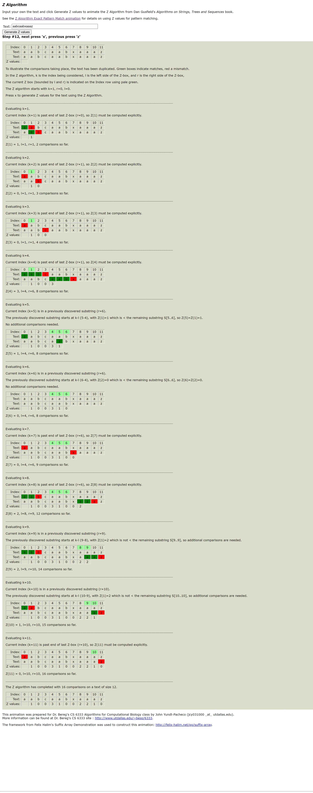

# Z Algorithm

> Z 函数（扩展 KMP）用来计算字符串中以下标i开头的子串s[i, n-1)和s的最长公共前缀LCP



## 例题

:::info[[3031. 将单词恢复初始状态所需的最短时间 II](https://leetcode.cn/problems/minimum-time-to-revert-word-to-initial-state-ii/description/)]
给你一个下标从 0 开始的字符串 word 和一个整数 k 。

在每一秒，你必须执行以下操作：

移除 word 的前 k 个字符。

在 word 的末尾添加 k 个任意字符。

注意 添加的字符不必和移除的字符相同。但是，必须在每一秒钟都执行 两种 操作。

返回将 word 恢复到其 初始 状态所需的 最短 时间（该时间必须大于零）。

示例 1：

输入：word = "abacaba", k = 3

输出：2

解释：
第 1 秒，移除 word 的前缀 "aba"，并在末尾添加 "bac" 。因此，word 变为 "cababac"。

第 2 秒，移除 word 的前缀 "cab"，并在末尾添加 "aba" 。因此，word 变为 "abacaba" 并恢复到始状态。

可以证明，2 秒是 word 恢复到其初始状态所需的最短时间。
:::

```cpp
class Solution {
 public:
  int minimumTimeToInitialState(string s, int k) {
    int n = s.size();
    vector<int> z(n);
    int l = 0, r = 0;
    for (int i = 1; i < n; ++i) {
      // z[i-l]>r-i+1 => 以i开头LCP长度可能大于当前z-box需要继续判断
      if (i <= r) z[i] = min(z[i - l], r - i + 1);
      while (i + z[i] < n && s[z[i]] == s[i + z[i]]) {
        l = i;
        r = i + z[i];
        z[i]++;
      }
      if (i % k == 0 && z[i] >= n - i) return i / k;
    }
    return (n - 1) / k + 1;
  }
};
```

## 参考

> https://personal.utdallas.edu/~besp/demo/John2010/z-algorithm.htm
