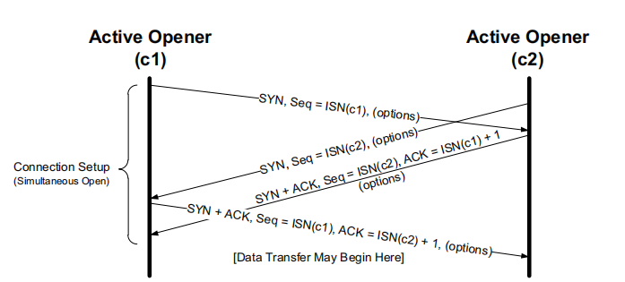
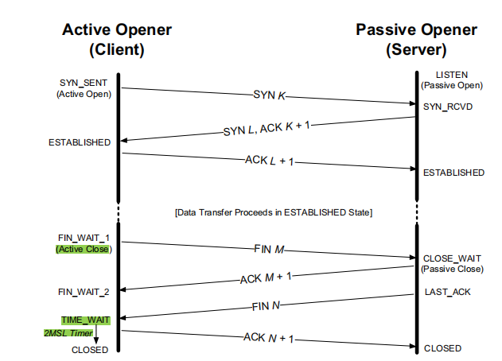
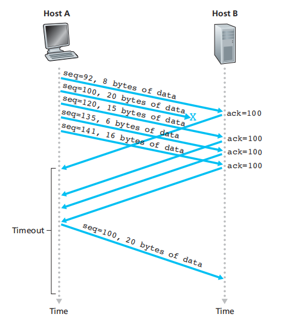
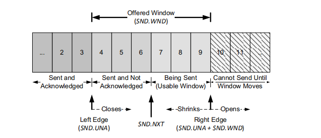
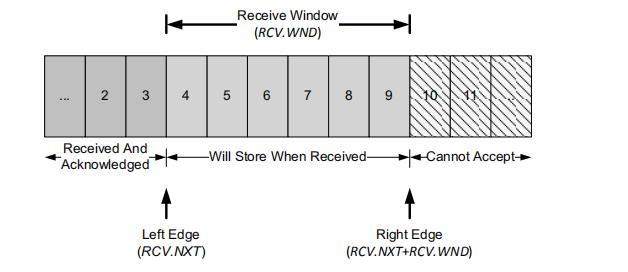

# Transport Layer

## UDP

### UDP header

## TCP

### TCP header

### TCP 3-handshake

1. ISN(Initial Sequence Number) is select randomly
2. 3 times handshake is a kind of protect for server side.
   In the case that client has sent SYN but get server's ACK and
   SYN late(timeout), client thinks the server does not response
   but server thinks handshake has completed and wait idlely.

### TCP 4-handwave

1. 四次挥手，因为被动关闭方将，对主动关闭的确认和关闭连接操作两次进行
2. 主动关闭方在返回被动关闭方FIN的ACK后，有一个2MSL(Max Segment Lifetime)的time wait
   1. 为了给被动方的FIN返回ACK，防止第一次返回的ACK丢失（此时server重传FIN）
   2. 可能存在已失效的连接请求报文段，防止这种报文段出现在本次连接之外（如新连接和旧连接端口相同，这时收到旧连接的packet会认为合法），防止串话

### TCP可靠性

#### time based 重传

1. 每个TCP连接RTO(Retransmission Timeout)根据对应RTT(Round Trip Time)设置
2. 每个TCP设置计时器，超出TRO后重传
3. Classic Method
   1. $SRTT\leftarrow \alpha (SRTT)+(1-\alpha) RTT_{s}\qquad \alpha\in[0.8,0.9]$
   2. $RTO=\min(ubound,\max(lbound,(SRTT)\beta))\qquad \beta\in[1.3,2.0],ubound=1min,lbound=1s$
4. Standard Method
   1. 考虑网络波动
   2. $srtt\leftarrow (1-g)(srtt)+(g)M\qquad M=\text{mean deviation}$
   3. $rttvar\leftarrow (1-h)(rttvar)+(h)(|M-srtt|)$
   4. $RTO=srtt+4(rttvar)$

#### 快重传

1. TCP reveiver在收到乱序的segment时会立即生成ACK
2. TCP sender在收到重复ACK时，需确定是丢包还是延迟，当重复ACK超过duplicate ACK threshold时判断丢包，进行重传
3. 快重传不需等待RTO

### TCP流量控制

#### 延迟ACK

1. 在收到packet要发送ACK时，延时等待一会，将ACK放入可能出现的要send to对端的packet中

#### Nagle算法

1. 当TCP发出的packet未收到ACK时，禁止发送small segment($< SMSS(Sender Maximum Segment Size)$)
2. 相当于一个self-clocking，ACK返回的越快，可以越快send data
3. nagle相当于一个trade-off，使用少量大packet（增加载荷），但相对增大了delay

#### 滑动窗口

1. TCP header的windows size filed 标识empty receive buffer space(Bytes)
2. 最大$SEQ=ACK+\text{Window Size}$
3. sender会定时发送window probes去询问reveiver是否有空余，强制recevier返回ACK和Winodw Size
4. SWS(Silly Window Syndrome) 发生时，只有小的数据报被传输而非full-size，避免方法如下
   1. receiver不advertise small window
   2. sender根据nagle算法，不发送small segment

### TCP拥塞控制

#### 慢启动

1. 当TCP建立或丢包产生时，进行慢启动
2. 慢启动即在SYN交换后，cwnd(Congestion Winodow)=IW(Initial Winodw)，通常=SMSS
   随后如果没有loss packet，$W=2\times W_{pre}$
3. delay ACK会降低增加速度，所以通常在slow start后才使用
4. 一般TCP发送速率为$W/RTT$，当W过大时，cwnd会减少到之前的一半，这个转换点为ssthresh(slow start threshold)

#### 拥塞避免（加法增大）

1. 当经过ssthresh后，$cwnd_{t+1}=cwnd_{t}+SMSS*SMSS/cwnd_{t}$，cwnd每次只+about 1

#### 乘法减小

1. 当收到重复ACK进行快重传后，设置$ssthresh=\max(\text{flight size}/2,2*SMSS)$

#### 快恢复

1. 快恢复在TCP reno版本引入，旧版theno无
2. 进行乘法减小后，并不从$cwnd=1MSS$开始慢启动，而是从新的ssthresh，开始加法增大

### TCP粘包

1. TCP是流协议，可能存在接收端一次读取两段或多段数据，无法区分
2. 原因
   1. Nagle算法，TCP并不立刻发送此段数据，而是等待一小段时间，看看在等待期间是否还有要发送的数据，若有则会一次把多段数据发送出去
   2. 接收端接收不及时造成的接收端粘包。TCP会把接收到的数据 存在自己的缓冲区中，然后通知应用层取数据。当应用层由于某些原因 不能及时取出TCP的数据，就会造成TCP缓冲区中存放了多段数据
3. 解决
   1. 封包，给一段数据加上包头--一个固定大小的结构体，有一个成员变量表示包体长度
