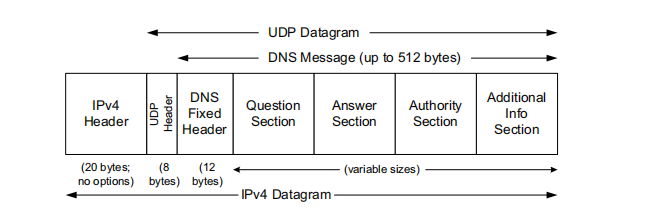
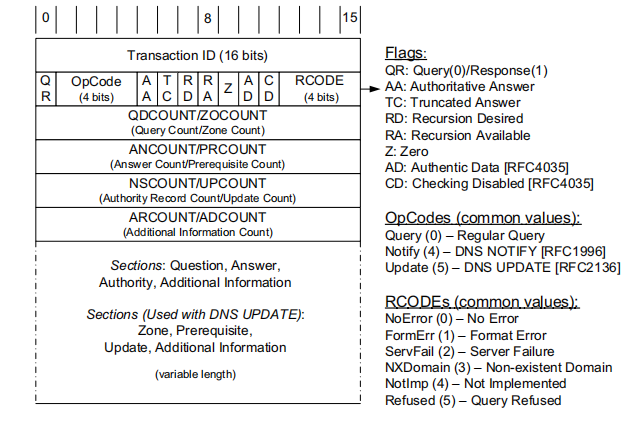
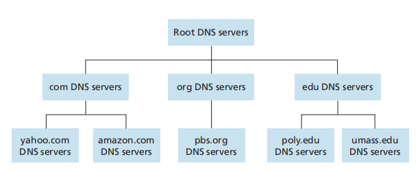
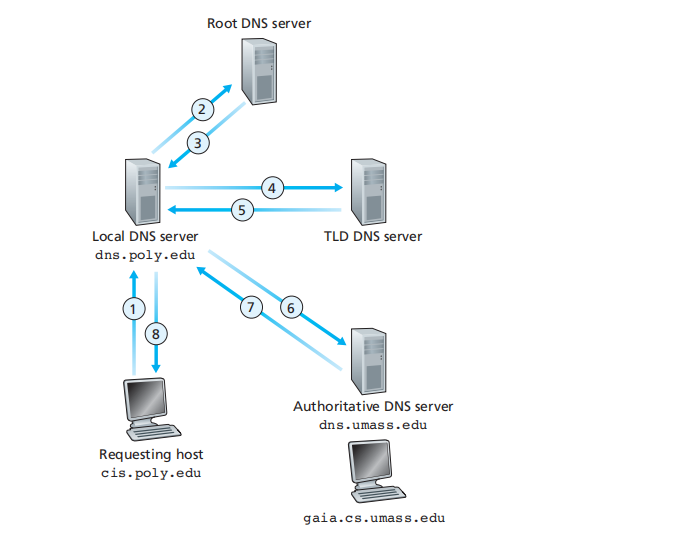
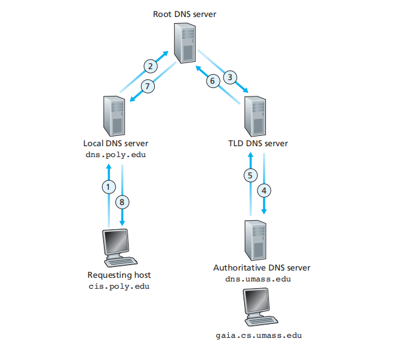
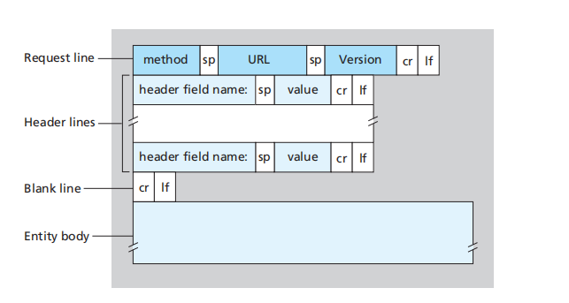
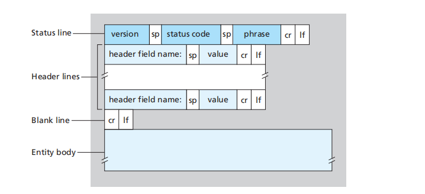

# 应用层

## DNS

### DNS报文

### DNS层次结构

1. 根域名服务器，解析顶级域名
2. 顶级域名服务器，解析二级域名
3. 权威域名服务器，解析区内域名
4. 本地域名服务器

### 解析过程

#### 迭代查询

1. host和local DNS server之间是递归查询

#### 递归查询

### DNS记录类型

|       |                                                                                                         |
| :---- | :------------------------------------------------------------------------------------------------------ |
| A     | 地址记录（Address），返回域名指向的IP地址                                                               |
| NS    | 域名服务器记录（Name Server），返回保存下一级域名信息的服务器地址该记录只能设置为域名，不能设置为IP地址 |
| MX    | 邮件记录（Mail eXchange），返回接收电子邮件的服务器地址                                                 |
| CNAME | 规范名称记录（Canonical Name），返回另一个域名，即当前查询的域名是另一个域名的跳转                      |
| PTR   | 逆向查询记录（Pointer Record），只用于从IP地址查询域名                                                  |

### DNS Cache

1. TTL 设置了DNS cache过期时间，较短的 TTL 是的记录能够快速刷新

## Http

### http1.0

#### URL

scheme://host[:port#]/path/…/[?query-string][#anchor]
|              |                                                                                    |
| :----------- | :--------------------------------------------------------------------------------- |
| 名称         | 功能                                                                               |
| scheme       | 访问服务器以获取资源时要使用哪种协议，比如，http，https 和 FTP 等                  |
| host         | HTTP 服务器的 IP 地址或域名                                                        |
| port#        | HTTP 服务器的默认端口是 80，这种情况下端口号可以省略，如果使用了别的端口，必须指明 |
| path         | 访问资源的路径                                                                     |
| query-string | 发给 http 服务器的数据                                                             |
| anchor       | 锚                                                                                 |

#### 请求

|         |                                                                                                                                                                                                   |
| :------ | :------------------------------------------------------------------------------------------------------------------------------------------------------------------------------------------------ |
| 方法名  | 功能                                                                                                                                                                                              |
| GET     | 向指定的资源发出“显示”请求，使用 GET 方法应该只用在读取数据上，而不应该用于产生“副作用”的操作中                                                                                                   |
| POST    | 指定资源提交数据，请求服务器进行处理（例如提交表单或者上传文件）。数据被包含在请求文本中。这个请求可能会创建新的资源或者修改现有资源，或两者皆有。                                                |
| PUT     | 向指定资源位置上传其最新内容                                                                                                                                                                      |
| DELETE  | 请求服务器删除 Request-URI 所标识的资源                                                                                                                                                           |
| OPTIONS | 使服务器传回该资源所支持的所有HTTP请求方法。用*来代替资源名称，向 Web 服务器发送 OPTIONS 请求，可以测试服务器功能是否正常运作                                                                     |
| HEAD    | 与 GET 方法一样，都是向服务器发出指定资源的请求，只不过服务器将不传回资源的本文部分，它的好处在于，使用这个方法可以在不必传输全部内容的情况下，就可以获取其中关于该资源的信息（原信息或称元数据） |
| TRACE   | 显示服务器收到的请求，主要用于测试或诊断                                                                                                                                                          |
| CONNECT | HTTP/1.1 中预留给能够将连接改为通道方式的代理服务器。通常用于 SSL 加密服务器的链接（经由非加密的 HTTP 代理服务器）                                                                                |

#### 响应

|        |                                                                |
| :----- | :------------------------------------------------------------- |
| 状态码 | 对应的信息                                                     |
| 1xx    | 提示信息—表示请求已接收，继续处理                              |
| 2xx    | 用于表示请求已被成功接收、理解、接收                           |
| 3xx    | 用于表示资源（网页等）被永久转移到其它 URL，也就是所谓的重定向 |
| 4xx    | 客户端错误—请求有语法错误或者请求无法实现                      |
| 5xx    | 服务器端错误—服务器未能实现合法的请求                          |

- 204 No Content 服务器接受的请求已成功处理，但返回的响应报文的主体部分不包含实体（浏览器页面不更新，仅发送信息给服务器）
- 206 Partial Content 客户端进行了范围请求，而服务器成功执行了这部分请求
- 301 Moved Permanently 永久性重定向，请求的资源已经分配了新的URI，以后应该使用资源现在所指的URI
- 302 Found 临时性重定向，请求的资源临时分配了新的URI，希望用户本次可以使用新的URI访问
  注意：当301,302,303响应状态码返回时，几乎所有的浏览器会把POST改成GET，并删除请求报文内的主体，之后请求会自动再次发送
- 304 Not Modified 服务器端资源未改变，可直接使用客户端未过期的缓存，不包含任何响应的主体部分
- 400 Bad Request 请求报文中存在语法错误
- 401 Unauthorized 请求需要有通过HTTP认证的认证信息。另外如果之前已进行一次请求，则表示用户认证失败
- 403 Forbidden 对请求资源的访问被服务器拒绝了，如未获得文件系统的访问授权，访问权限出现某些问题
- 404 Not Found 服务器上没有请求的资源
- 499 client has closed connection 服务器端处理的时间过长，客户端主动断开链接，ngix定义的状态码
- 500 Internal Server Error 服务器在执行请求时发生了错误，Bug或临时故障
- 503 Service Unavailable 服务器暂时处于超负荷或正在进行停机维护，现在无法处理请求

#### http 缓存

#### http 分块传输

#### http 内容协商

在服务端驱动型协商机制或者主动协商机制中，浏览器（或者其他任何类型的用户代理）会随同 URL 发送一系列的消息头。这些消息头描述了用户倾向的选择。服务器则以此为线索，通过内部算法来选择最佳方案提供给客户端

#### http 虚拟主机

#### http 通信数据转发

### http1.1

1. m 默认使用长连接，一次TCP能进行多粗http通信
2. \+ 默认持久连接
3. \+ 管线化
4. \+ 断点续传
   1. 使用范围请求，在http请求增加请求头 Ranges: bytes=0-
   2. 多重范围请求秩序包含多个范围 bytes=0-50, 100-150
   3. 响应包含
      - Accept-Ranges: none(不支持)/bytes（支持时，单位）
      - content-Range: bytes 0-1023/146515
5. \+ host字段
6. \+ Cache-Control
   1. 用来代替http1.0的 Expires

### http2.0

1. \+ 使用二进制，而非明文文本格式传输
2. \+ 完全多路复用
3. \+ 报头压缩
4. \+ 服务可主动推送到客户端缓存中

### https

1. https = http + TLS/SSL
   
