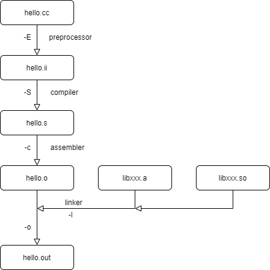
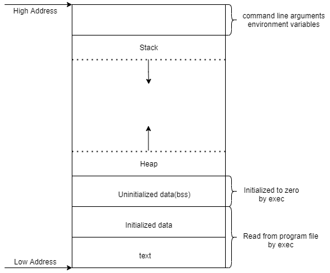

# C++

## 编译及g++选项



1. 预处理
   1. 处理条件编译指令
   2. 处理头文件包含指令
   3. 处理宏定义指令
   4. 消除注释
2. 编译
   1. 词法语法分析，生成汇编
3. 汇编
   1. 生成机器指令
4. 链接
   1. 解决符号（函数，变量）的相互引用，符号的引用本质是对其在内存中具体地址的引用
   2. 符号重定位要解决的是当前编译单元如何访问「外部」符号这个问题
   3. 装载时重定位
      1. 因为编译是以源文件为单位进行的，编译器此时并没有一个全局的视野，因此对一个编译单元内的符号它是无法确定其最终地址的，而对于可执行文件来说，在现代操作系统上，程序加载运行的地址是固定或可以预期的
      2. 编译器当前并不知道 g_share 这个变量最后会被分配到哪个地址上，因此在这儿只是随便用一个假的来代替，等着到接下来链接时，再把该处地址进行修正。那么，链接器怎么知道目标文件中哪些地方需要修正呢？很简单，编译器编译文件时时，会建立一系列表项，用来记录哪些地方需要在重定位时进行修正，这些表项叫作“重定位表”(relocatioin table)
      3. 有了如上信息，链接器在把目标文件合并成一个可执行文件并分配好各段的加载地址后，就可以重新计算那些需要重定位的符号的具体地址了
   4. 地址无关代码
      1. 位置无关代码在数据段开始为每一个全局符号保留了一个条目（GOT global offset table），每一个条目中保存了全局符号的绝对地址（这个绝对地址，在动态链接库装载的时候被填写），每次对动态链接中全局符号的引用，首先找到GOT中的条目，然后获得全局符号的地址，这样就实现了位置无关代码

```bash
g++ -E hello.cc > hello.i
g++ -S b.i
g++ -c b.s
g++ -lstdc++ b.o
./a.out
```

## 静态和动态链接库

1. 静态
   1. 库函数被包含在每一个运行的进程中，会造成主存的浪费
   2. 目标文件的size过大
   3. 每次更新一个模块都需要重新编译，更新困难，使用不方便
2. 动态库
   1. 是一个目标文件，包含代码和数据，它可以在程序运行时动态的加载并链接
   2. 动态库可被多个进程共享

## volatile作用

1. volatile的作用就是当一个线程更新某个volatile声明的变量时，会通知其他的cpu使缓存失效，从而其他cpu想要做更新操作时，需要从内存重新读取数据
2. volatile并不保证原子性，如两个线程AB执行对i=100执行++操作，在A获取值时B运行并++，虽然此时101时可见的，但是A已经获取了值100

## 宏

1. 使用括号避免错误
2. 使用 `do{}while(0)` or `({...})` 定义多行宏，每行末尾添加续行符`\`
   1. `do{}while(0)`的好处是可以使用`if`等跳出语句
   2. 仅使用`{}`会造成麻烦--是否在结尾添加`;`--如在`if()`后使用，会使`else`错误

```cpp
#define PI 3.14
#define ADDONE(x) (x + 1)


#define SQUARE(x) x * x
int tmp = SQUARE(3 + 3);  // tmp = 3 + 3 * 3 + 3

#define SQUARE(x) ((x) * (x))
int tmp = SQUARE(3 + 3);  // tmp = ((3 + 3) * (3 + 3))


// "x"
#define TOSTR(x) #x
string s = TOSTR(123);  //"123"

// xy
#define CONN(x, y) x##y
int a = (123, 456);  // a=123456


#ifndef _HEADER_H
#define _HEADER_H
// HEADER
#endif

__DATE__
__TIME__
__FILE__
__FUNCTION__
__LINE__
__cplusplus

//DEBUG
#define DBG(fmt, ...)             \
    do {                          \
        printf(fmt, __VA_ARGS__); \
    } while (0)

#define DBG(fmt, ...) ({ printf(fmt, __VA_ARGS__); })
```

## c、c++ 语言内存区块

1. c语言布局
   1. 
2. c++
   1. 栈区
   2. 堆区（new）
   3. 自由存储区（malloc）
   4. 全局区/静态区（不再区分是否初始化）
   5. 常量存储区

```cpp
// main.cpp

int a = 0;  //全局初始化区
char *p1;   //全局未初始化区
void main() {
  int b;                    //栈
  char s[] = "abc";         //栈
  char *p2;                 //栈
  char *p3 = "123456";      // 123456在常量区，p3在栈上
  static int c = 0;         //全局（静态）初始化区
  p1 = (char *)malloc(10);  //分配得来得10字节的区域在堆区
  p2 = (char *)malloc(20);  //分配得来得20字节的区域在堆区
  strcpy(p1, "123456");
  // 123456放在常量区，编译器可能会将它与p3所指向的"123456"优化成一块
}
```

## Static用法

1. 静态局部变量
   1. 静态局部变量在程序执行到该对象的声明处时被首次初始化，即以后的函数调用不再进行初始化(局部变量每次函数调用都会被初始化)
   2. 静态局部变量一般在声明处初始化，如果没有显式初始化，会被程序自动初始化为0(局部变量不会被初始化)
   3. 它始终驻留在全局数据区，直到程序运行结束。但其作用域为局部作用域，也就是不能在函数体外面使用它(局部变量在栈区，在函数结束后立即释放内存);
2. 静态全局变量
   1. 定义在函数体外，用于修饰全局变量，表示该变量只在本文件可见（文件隔离）
3. 静态函数
   1. 类似静态全局变量
   2. 静态函数不能被其它文件所用
   3. 其它文件中可以定义相同名字的函数，不会发生冲突
4. 静态成员变量
   1. 静态成员变量属于类，一个类的各个实例共享
5. 静态成员函数
   1. 静态成员函数不能访问非静态(包括成员函数和数据成员)，但是非静态可以访问静态

```cpp
void foo() {
  static int i = 1;
  ++i;
  cout << i << " ";
}
foo();  // i==2
foo();  // i==3

// a.cc
int n = 1;  // normal
static int n = 1;  // b.cc:(.text+0x6): undefined reference to `n'

// b.cc
extern int n;

int main() {
  cout << n << endl;
  return 0;
}
```

## extern用法

1. extern变量和函数
   1. 可以修饰变量和函数，表示该变量或函数在其他的地方被定义（本源文件或其他源文件），在这里声明使用它，这样多个源文件共享变量和函数
2. extern "C"
   1. 告知编译器按C语言规则寻找函数名，C++会修改函数名（通常加上返回类型和参数类型）

```cpp
int func(int a, double b) { return 0; }
// c func
// c++ _Z4funcid


#ifdef __cplusplus
extern "C" {
#endif
/* Declarations of this file */
#ifdef __cplusplus
}
#endif
```

## 指针和引用

1. 指针和引用区别
   1. 指针可以为空，引用不行
   2. 指针可以不初始化，引用必须初始化
   3. 指针所指可以改变，引用初始化后所指不可改变（因为是指针常量）
   4. 指针和引用的`++`意义不同
   5. 指针sizeof得到指针大小，引用sizeof得到类型大小
2. 引用的底层
   1. 引用是个指针常量`int* const ra =&a`
   2. 通过汇编可看出引用其实是个指针
      1. lea 了一个地址
         1. mov 会解地址，实际移动的为值
         2. lea 不会解地址，直接赋值地址
      2. 大小为8B，（64bits machine）
      3. 另外a的地址为数据rbp-数据总大小（包含padding）
      4. 使用`int *pa=&a` 得到相同的汇编
      5. 使用`const`也得到相同汇编

## new与malloc

| 特征                 | new/delete                            | malloc/free                            |
| :------------------- | :------------------------------------ | :------------------------------------- |
| 分配内存的位置       | 自由存储区                            | 堆                                     |
| 内存分配成功的返回值 | 完整类型指针                          | void*                                  |
| 内存分配失败的返回值 | 默认抛出异常                          | 返回NULL                               |
| 分配内存的大小       | 由编译器根据类型计算得出              | 必须显式指定字节数                     |
| 处理数组             | 有处理数组的new版本new[]              | 需要用户计算数组的大小后进  行内存分配 |
| 已分配内存的扩充     | 无法直观地处理                        | 使用realloc简单完成                    |
| 是否相互调用         | 可以，看具体的operator new/delete实现 | 不可调用new                            |
| 分配内存时内存不足   | 客户能够指定处理函数或重新制定分配器  | 无法通过用户代码进行处理               |
| 函数重载             | 允许                                  | 不允许                                 |
| 构造函数与析构函数   | 调用                                  | 不调用                                 |

## 函数指针

1. 函数名`say`是一个函数指针常量，`fp`是一个函数指针变量
2. 函数被隐式转换成函数指针
3. `*`解函数指针，得到的结果又会被隐式转换成函数指针
4. `$`只能使用一次，因为其结果是指向函数指针的指针，不能再对右值取地址

```cpp
void say(int num) { cout << "number is " << num << endl; }

void (*fp)(int);  // declare a function pointer
fp = &say;
(*fp)(1);
fp(1);

typedef void (*FP)(int);  // define a type of function pointer
FP f = say;
f(1);

void (*fp1)(int) = say;
void (*fp2)(int) = *say;
void (*fp3)(int) = &say;
void (*fp4)(int) = *&say;
void (*fp5)(int) = &*say;
void (*fp6)(int) = **say;
// void (*fp7)(int) = &&say; //error
void (*fp8)(int) = *******say;
```

## 函数重载

1. 函数会被 name mangling，及编译出的函数符号名称被修改，通常加上参数类型
2. 返回值不能用于重载
   1. 因为在编译期不会判断函数类型
   2. 我们可能忽略函数返回值，如使用`func()`而不是`int ret=func()`

## 在C中实现重载

1. 可变参数
   1. 可变参数原理，函数调用时参数从右到左压栈，只要知道第一个参数的地址和各个参数类型，就可得到所有参数
2. 函数指针
   1. 定义一个函数指针类型，再定义改类型的多个函数
   2. 利用`void*`接受任意类型指针，再在具体函数中处理类型

```cpp
int open(const char *pathname, int flags);
int open(const char *pathname, int flags, mode_t mode);

//variadic functions -> take variadic arguments
int open(const char *path, int oflag, ... ); // actual declaration

// enables access to variadic function arguments
// parmN <- Name of the last named parameter in the function definition
void va_start( va_list ap, parmN );

// the next variadic function argument
T va_arg( va_list ap, T );

// makes a copy of the variadic function arguments
void va_copy( va_list dest, va_list src );

// ends traversal of the variadic function arguments
void va_end( va_list ap );

// holds the information needed by va_start, va_arg, va_end, and va_copy
va_list args; // va_list is a type

int GetMax(int n, ...) {
  int res = INT_MIN;
  va_list args;
  va_start(args, n);
  for (int i = 0; i < n; ++i) {
    res = max(res, va_arg(args, int));
  }
  va_end(args); // necessary
  return res;
}

//func pointer
typedef void (*Add)(void* res, void*, void*);

void AddII(void* res, void* a, void* b) {
  *(int*)res = *(int*)a + *(int*)b;
}

void AddDD(void* res, void* a, void* b) {
  *(double*)res = *(double*)a + *(double*)b;
}

void Func(Add f, void* res, void* a, void* b) {
  f(res, a, b);
}

int ires, ia = 1, ib = 2;
double dres, da = 1.0, db = 2.0;
Func(AddII, &ires, &ia, &ib);
Func(AddDD, &dres, &da, &db);
```

## inline

1. inline的使用
   1. inline需要在函数定义（而非声明）前才有用
   2. inline只是建议，编译器不一定内联展开
   3. inline函数应该是小函数且被多次调用
   4. inline函数体内不应该有loop，if，switch，异常处理，递归；因为编译时无法确定到底要展开多少次
   5. inline函数不能是虚函数（虚函数发生在运行时，而内联展开在编译时）
   6. inline会将代码复制多次，占用内存
2. inline和宏函数的区别
   1. inline发生在编译期，宏在预处理期
   2. inline函数在编译期会进行类型检查，宏仅仅是文本替换
   3. inline函数利于调试（相比于宏）

## 字节对齐

1. 结构体变量的首地址能够被其最宽基本类型成员的大小所整除
2. 结构体每个成员相对于结构体首地址的偏移量都是成员大小的整数倍，如有需要编译器会在成员之间加上填充字节
3. 结构体的总大小为结构体最宽基本类型成员大小的整数倍，如有需要编译器会在最末一个成员之后加上填充字节

## 类的大小

1. 空类占1B
   1. 编译器添加1B，目的是让该类可以实例化，因为实例化其实就是分配地址，若为0无法分配
2. 类的函数
   1. 类的普通函数不占字节
   2. 类的虚函数不占字节，但是会引入虚表指针，占一个指针的大小
   3. 类的函数存放在代码区，同一个类的各个实例公用，调用时会隐式传递`this`指针
   4. 每个类实例公用函数，独享变量
   5. `A *pa=nullptr;`pa可成功调用不含成员变量的函数
   6. 函数参数的默认值是静态绑定的，若子类修改父类的默认参数值，调用子类虚函数依然会绑定父类的默认参数值

## 继承权限

1. 权限=min(继承权限, 函数或成员继承前的权限)

## 虚函数

1. 每个类都有一个`vptr`指向虚函数表（指针数组），虚函数表存放虚函数指针
2. 子类复用基类虚函数表
3. 若子类重写虚函数，函数指针变化
   1. 重载：函数名相同，函数的参数个数、参数类型或参数顺序三者中必须至少有一种不同
   2. 重定义：也叫做隐藏，子类重新定义父类中有相同名称的非虚函数 ( 参数列表可以不同 ) ，指派生类的函数屏蔽了与其同名的基类函数
   3. 重写：也叫做覆盖，一般发生在子类和父类继承关系之间，子类重新定义父类中有相同名称和参数的虚函数 override
4. g++ 中`vtable`位于类的开始，然后基类成员变量，最后子类成员变量
5. g++ 中`vptr`同样位于类的开始
6. 当添加虚析构函数后，vtable有两个析构函数
   1. complete object destructor，只执行析构函数不delete()
   2. deleting destructor，真正delete()

```cpp
class A {
 public:
  int a;
  virtual void vf() { cout << "A" << endl; }
};

class B : public A {
 public:
  int b;
  virtual void vf() { cout << "B" << endl; }
};
// Vtable for A
// A::_ZTV1A: 3 entries
// 0     (int (*)(...))0            <- top_offset
// 8     (int (*)(...))(& _ZTI1A)   <- RTTI
// 16    (int (*)(...))A::vf        <- vptr point here

// Class A
//    size=16 align=8
//    base size=12 base align=8
// A (0x0x7fc704efa420) 0
//     vptr=((& A::_ZTV1A) + 16)

// Vtable for B
// B::_ZTV1B: 3 entries
// 0     (int (*)(...))0
// 8     (int (*)(...))(& _ZTI1B)
// 16    (int (*)(...))B::vf        <- B use same vptr of A

// Class B
//    size=16 align=8
//    base size=16 base align=8
// B (0x0x7fc704e0ca28) 0
//     vptr=((& B::_ZTV1B) + 16)
//   A (0x0x7fc704efaae0) 0
//       primary-for B (0x0x7fc704e0ca28)
```

## 多继承

1. 非菱形 `class C : public A, public B` 
   1. 
   2. 成员变量按父类被声明顺序排序，接着是子类成员变量
   3. 子类的虚函数表只有一个，表项按父类被声明的顺序，中间隔开
   4. top_offset用于当从子类到基类的转换时改变`this`指针
   5. 当子类重写父类虚函数时，会有thunk加入基类的虚函数表，指向对应的子类虚函数
2. 菱形
   1. 假设有A,B(A),C(A),D(B,C)那么A的成员会被D继承两次，产生歧义
      1. `d.a = 1; //wrong`
      2. `d.B::a = 1; d.C::a = 1; //right`
   2. 使用虚继承解决菱形继承问题
      1. 
      2. 虚继承的子类，编译器为其生成一个虚函数指针（vptr）以及一张虚函数表，该vptr位于对象内存最前面；非虚继承直接扩展父类虚函数表
      3. VTT是所有vptr的集合

## 构造与析构函数

1. 默认构造析构函数
   1. 若无自己声明的任意以下`constructor`，编译器默认以`inline`方式声明以下构造函数
      1. `default constructor`
      2. `copy constructor`
      3. `copy assignment operator`
      4. `move constructor`
      5. `move assigment operator`
   2. 若无自己声明`destructor`，编译器默认自己生成
   3. 同时编译器会生成
      1. `Class* operator&()`
      2. `const Class* operator&()`
2. 构造函数
   1. 默认构造函数可初始化
      1. 若有类内初始化值，则按此初始化成员
      2. 调用成员对象的默认构造函数
   2. 构造函数初始化顺序
      1. 虚基类
      2. 非虚基类
      3. 对象成员
      4. 类自身构造
   3. 初始化列表中，变量被初始化的顺序决定于该变量在类中声明的位置
   4. `const`成员必须在初始化列表中
   5. `static`成员必须在类外初始化
3. 虚析构函数
   1. 析构函数应声明为虚函数，这样可以动态绑定真正的虚函数
   2. 构造函数不能为虚函数
      1. 创建对象时必须知道对象实际类型，虚函数行为是运行期间确定类型
      2. 虚函数依赖于虚函数表，构造对象期间虚函数表还未完全初始化

## constexpr 常量表达式

1. 用途
   1. 常量表达式运行计算发生在编译期
   2. 可以用于之前需要宏的场合，如数组大小
2. constexpr 限制
   1. 该函数只能有一个return，可用三元运算符`?:`代替分支return
   2. 该函数只能调用constexpr函数
   3. 只能使用全局constexpr变量
3. 与const区别
   1. constexpr的成员函数，变量默认也是const的，反之不是
   2. constexpr告知编译器其值编译期可知，反之无

## 类型转换

1. C风格强制转换
   1. `TypeA a = (TypeA)b`
2. const_cast
   1. 去除引用或指针的const限制
3. static_cast
   1. 类似强制转换，但是会进行编译期类型检查
4. dynamic_cast
   1. `dynamic_cast`主要用于父子类之间转换，尤其是父到子的向下转型
   2. 向上转型时等于`static_cast`
   3. 向下转型时会进行动态检查，若转换失败指针返回空，引用抛出错误；仅当基类类型指针指向子类对象时可向下转换成功

## 智能指针

1. 解决内存泄漏
   1. 保证堆上的对象一定会被释放，任何智能指针不应指向非堆内存，因为非堆内存不能delete
2. 本质RAII，使用对象管理资源，构造时获取资源，析构时释放
3. 两种模型
   1. 所有权
   2. 引用计数
4. auto_ptr
   1. auto_ptr使用所有权模型
   2. deprecated
      1. 存在潜在风险，因为失去所有权的auto_ptr指向空，运行时出错
5. unique_ptr
   1. `unique_ptr`用来代替auto_ptr，失去所有权同样指向空，但是后续如果在使用这个空指针，这个错误可被发现在编译期
   2. `unique_ptr`支持移动语义
6. share_ptr weak_ptr
   1. `shared_ptr`引用计数模型
   2. `weak_ptr`是一种弱引用，不增加或减少引用计数
   3. 问题
      1. `shared_ptr`可能造成循环引用，需要使用`weak_ptr`解决
      2. 不应用一个`raw pointer`初始化多个`shared_ptr`，会造成double free问题，因为此时有多个引用计数且都为1
      3. `this`指针也是`raw pointer`，在类中若想将`this`传递应该继承`enable_shared_from_this`
      4. 在调用`shared_from_this()`前应确保对象被`shared_ptr`持有，而不是一个`raw pointer`或`raw objector`，否则相当于调用`this`初始化多个`shared_ptr`

```cpp
template <typename T>
class SmartPointer {
 private:
  T* _ptr;
  size_t* _count;

 public:
  SmartPointer(T* ptr = nullptr) : _ptr(ptr) {
    if (_ptr) {
      _count = new size_t(1);
    } else {
      _count = new size_t(0);
    }
  }

  SmartPointer(const SmartPointer& ptr) {
    if (this != &ptr) {
      this->_ptr = ptr._ptr;
      this->_count = ptr._count;
      (*this->_count)++;
    }
  }

  SmartPointer& operator=(const SmartPointer& ptr) {
    if (this->_ptr == ptr._ptr) {
      return *this;
    }

    if (this->_ptr) {
      (*this->_count)--;
      if (this->_count == 0) {
        delete this->_ptr;
        delete this->_count;
      }
    }

    this->_ptr = ptr._ptr;
    this->_count = ptr._count;
    (*this->_count)++;
    return *this;
  }

  T& operator*() {
    assert(this->_ptr == nullptr);
    return *(this->_ptr);
  }

  T* operator->() {
    assert(this->_ptr == nullptr);
    return this->_ptr;
  }

  ~SmartPointer() {
    (*this->_count)--;
    if (*this->_count == 0) {
      delete this->_ptr;
      delete this->_count;
    }
  }

  size_t use_count() { return *this->_count; }
};
```

## 完美转发

```cpp
template<typename T>
T&& forward(typename remove_reference<T>::type& param)
{
  return static_cast<T&&>(param); //可能会发生引用折叠！
}
```

1. 完美转发保证内部函数调用时，参数类型和传入到外部时的一致
2. 引用折叠规则
   1. 所有右值引用折叠到右值引用上仍然是一个右值引用。如X&& &&折叠为X&&
   2. 所有的其他引用类型之间的折叠都将变成左值引用。如X& &, X& &&, X&& &折叠为X&。可见左值引用会传染，沾上一个左值引用就变左值引用了。根本原因：在一处声明为左值，就说明该对象为持久对象，编译器就必须保证此对象可靠（左值）
3. 
   1. 当传递给func函数的实参类型为左值Widget时，T被推导为Widget&类别。然后forward会实例化为`std::forward<Widget&>`，并返回Widget&（左值引用，根据定义是个左值！）
   2. 而当传递给func函数的实参类型为右值Widget时，T被推导为Widget。然后forward被实例化为`std::forward<Widget>`，并返回Widget&&（注意，匿名的右值引用是个右值！）

## stl六大组件

1. 容器，STL容器包含两种：序列式容器主要有vector、list、deque，以及关联式容器主要有set、map、multiset、multimap
2. 算法
3. 迭代器，STL中迭代器主要用来把容器和算法结合起来，扮演容器与算法之间的胶合剂，是所谓的“泛型指针”
4. 仿函数
5. 适配器，适配器主要用来修饰容器接口、迭代器接口或仿函数接口的东西；STL提供了stack、queue两种容器适配器，stack和queue的底层完全是由deque来实现的
6. 空间配置器，STL的空间配置器主要用来给容器进行空间的配置与管理，从实现的角度来说空间配置器是实现了一个动态分配空间、空间管理、空间释放的class template（类模板）

## stl容器底层实现

1. vector
   1. 数组
2. list
   1. 双向链表
3. deque
   1. 数组+链表（索引数组+分段数组）
4. queue
   1. list / deque
5. priority_queue
   1. vector实现堆，默认最大堆（堆顶为compare比较后最后一个元素）
   2. 使用 make_heap() push_heap() sort_heap()
6. stack
   1. list / deque
7. map
   1. 红黑树
8. set
   1. 红黑树, key value相同
9. unordered_map
   1. hash_table
10. unordered_set
    1. hash_table
11. multiset
    1. 红黑树，插入操作采用的是底层机制RB-tree的insert_equal()而非insert_unique()

## 迭代器种类

1. Input iterator(输入迭代器) 可读 只支持自增运算
2. Output iterator(输出迭代器) 可写 只支持自增运算
3. Forward iterator(前向迭代器) 读写 只支持自增运算
4. Bidirectional iterator(双向迭代器) 读写 支持自增和自减运算
5. Random access iterator(随机访问迭代器) 读写 支持完整的迭代器算术运算

## vector迭代器失效

1. 删除时，后面的数据要移动，后面的迭代器都失效，但erase()函数可返回下一个元素的新的迭代器
2. 插入时，可能触发扩容

## gdb调试

1. r(run) b(break) l(list) n(next) p(print)
2. info threads查看 thread 3 切换
3. x/nfu addr 以f格式打印从addr开始的n个长度单元为u的内存值
   1. n：输出单元的个数。
   2. f：是输出格式。比如x是以16进制形式输出，o是以8进制形式输出,等等。
   3. u：标明一个单元的长度。b是一个byte，h是两个byte（halfword），w是四个byte（word），g是八个byte（giant word）
4. 分析core文件，gdb 程序名 core文件名
5. 调试一个正在运行的程序，gdb -p PID