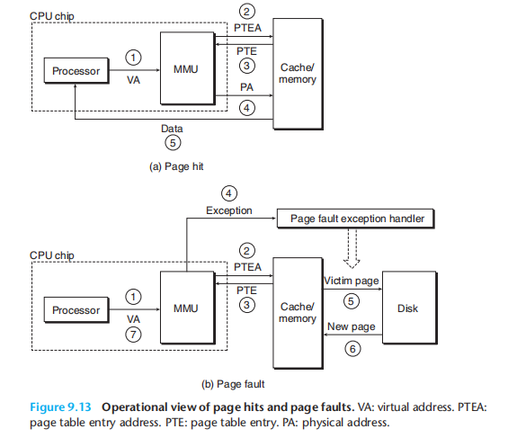
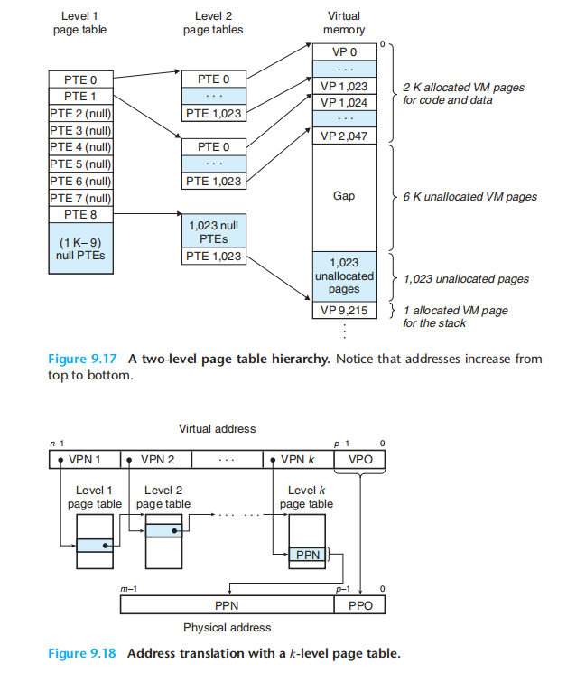
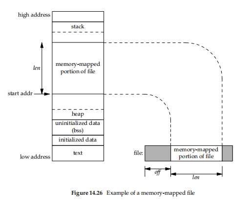
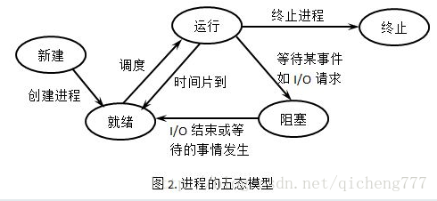
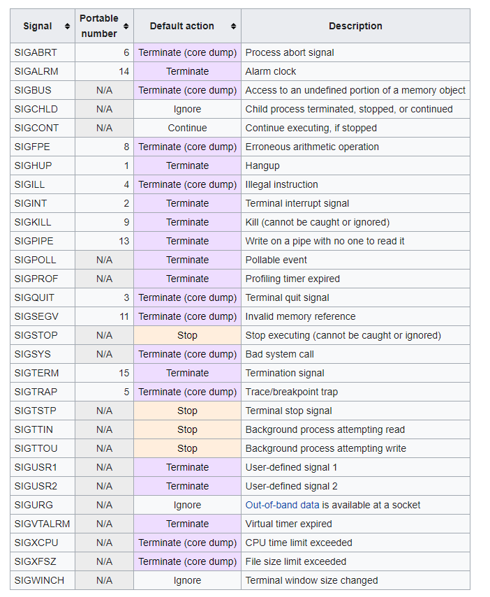

# OS

## linux开机顺序

1. 加电
2. 加载BIOS
3. 加载磁盘中MBR（主引导分区）的grub（GRand Unified Bootloader）引导
4. 加载linux内核到内存；运行/sbin/init进程
5. 加载配置文件/etc/inittab
6. 根据/etc/modules.conf /etc/modules.d/加载内核模块
7. 根据运行级别运行rc0.d-rc6.d中相应的脚本程序，完成对应初始化工作和启动对应服务
8. 启动init.d/下的系统进程
9. 出现登录画面

## 敲击键盘时linux处理过程

1. 键盘控制器产生数据；并缓冲中键盘控制器寄存器中
2. 价盘控制器发送中断请求
3. 操作系统保存被中断进程的上线问；调用键盘的中断处理程序（又键盘的驱动程序初始化时注册）
4. 将键盘控制器缓存的数据转化为ASCII加入读缓冲队列
5. 显示设备驱动定时读取上述读缓冲队列加入自己的写缓冲队列；显示自己写缓冲队列中的数据
6. 恢复被中断的进程

## 用户态和内核态

1. 用户态和内核态
2. 32bit
   1. 用户态空间占0G-3G部分，内核态占3G-4G部分（高地址）
   2. 用户态和内核态的主要区别是权限不同，分别为（Ring3最低 Ring0最高）
   3. 用户态到内核态的切换方式
      1. 系统调用
      2. 异常
      3. 外围设备中断
   4. 具体切换流程
      1. 内核创建进程task_struct时，会为进程创建两个栈，用户栈和内核栈
      2. 在用户空间运行时cpu栈指针指向用户栈
      3. 切换时先将用户态堆栈指针ss和esp压入内核堆栈
3. 64bit
   1. 总空间大小一般48bit

## 堆栈

1. 程序运行时内存布局
2. 栈帧结构

## 虚拟内存优点

1. 虚拟内存为每个进程提供了统一的地址空间
2. 使各个程序独立安全，不同进程中的va对应不同pa，不同进程不可能访问到其他进程的pa
3. 因为进程仅被分配虚拟内存页面，这些页面的数据可以映射到物理页面，也可以临时保存到磁盘上（swap）而不占用物理页面；根据需要pageout或pagein

## 分页与分段

1. 
2. 分页
   1. 将程序的逻辑地址空间划分为固定大小的页(page)，而物理内存划分为同样大小的页框(page frame)
   2. 程序加载时，可将任意一页放人内存中任意一个页框，这些页框不必连续，从而实现了离散分配
3. 分段
   1. 虚拟内存空间根据用途被分为 代码段 数据段 堆 栈

## 页命中与缺页

1. page hit & page fault 
2. page hit & page fault 
3. 页表存储在内存中
4. MMU中存在TLB（translation lookaside buffer）用来缓存PTE，加速查找

## 地址转换

1. address translation 

## 多级页表

1. 多级页表结构 
2. 多级页表减少了页表在内存中的大小

## 页置换算法

1. FIFO 淘汰最早进入内存的页面
2. LRU 淘汰最近没有使用的页面
3. LFU 淘汰最不常访问（计数最小）的页面
4. OPT 淘汰以后不会使用的页面

## mmap

1. `void *mmap(void *addr, size_t len, int prot, int flag, int fd, off_t off );` 
2. 实现
   1. 在当前进程的虚拟空间中，寻找一段空闲的满足要求的连续虚拟地址
   2. 为次虚拟分区分配一个vm_area_struct结构
   3. 将vm_area_struct插入进程的虚拟地址分区链表中
3. 有点
   1. 普通read() write()会先将数据保存在内核buffer中，导致两次数据拷贝；mmap()直接拷贝到用户空间
   2. mmap()使得用户空间和内核空间可以交互
   3. mmap()同时也是进程间通信的方式
4. 落盘时机
   1. 一定时间延迟后
   2. 调用msync()或munmap()
   3. 内存不足
   4. 进程退出

## 进程状态

1. 进程状态 

## 进程调度

1. FCFS 先来先服务
2. SJF 短作业优先
   1. 长作业可能饥饿
3. 基于优先权
   1. 非抢占式
   2. 抢占式
   3. 低优先级可能饥饿
4. 响应比优先
   1. $R_p=\frac{等待时间+要求服务时间}{要求服务时间}$
5. 时间片轮转
6. 多级反馈队列
   1. 按优先级划分多个就绪队列，每个队列的时间片大小随优先级增大而减小
   2. 仅当i-1队列为空时，队列i的任务被执行
   3. 新线程进入时加入优先级最高的队列，执行完时间片后移入下一个队列
   4. 在若干cpu时间后将低优先级队列的进程放入高优先级队列防止饥饿
7. CFS 完全公平算法
   1. $分配给进程的运行时间=\frac{调度周期*进程权重}{所有进程权重和}$ 其中调度周期是遍历所有task_running状态的进程的时间和
   2. $vruntime=\frac{实际运行时间*1024}{进程权重}$
   3. 根据vruntime的大小决定运行顺序（小的优先），红黑树记录vruntime-min_vruntime防止值溢出
   4. 权重通过nice值转换，nice越大权重越低
   5. 新进程的vruntime的红黑树中记录的min_vruntime，防止旧进程饥饿
   6. 休眠进程被唤醒时，vruntime以min_vruntime为基础，并进行少量补偿
   7. 进程在cpu间切换时，首先减去当前cpu的min_vruntime转移后加上目标cpu的min_vruntime

## 孤儿进程与僵尸进程

1. 孤儿进程
   1. 父进程退出的进程
   2. 孤儿进程会被init进程收养
2. 僵尸进程
   1. 子进程退出但父进程未调用wait()或waitpid()，那么子进程仍然保留在系统中，成为僵尸进程defunct
   2. 僵尸进程会占用占用资源
   3. 解决
      1. 父进程代码中调用wait()或waitpid()
      2. 子进程退出时向父进程发送SIGCHILD信号，父进程处理SIGCHILD信号。在信号处理函数中调用wait进行处理僵尸进程
      3. fork()两次，子进程创建孙子进程，子进程直接退出，孙子进程执行操作，此时孙子进程成为孤儿交由init管理
      4. kill，kill不掉时kill僵尸进程的父进程
      5. 重启

## 打开文件表

1. 每个进程都有一个打开文件表

## fork vfork clone

1. fork() 的子进程是父进程的完全副本
   1. 相同
      1. Real user ID, real group ID, effective user ID, and effective group ID
      2. Supplementary group IDs
      3. Process group ID
      4. Session ID
      5. Controlling terminal
      6. The set-user-ID and set-group-ID flags
      7. Current working directory
      8. Root directory
      9. File mode creation mask
      10. Signal mask and dispositions
      11. The close-on-exec flag for any open file descriptors
      12. Environment
      13. Attached shared memory segments
      14. Memory mappings
      15. Resource limits
   2. 不同
      1. The return values from fork are different.
      2. The process IDs are different.
      3. The two processes have different parent process IDs: the parent process ID of the child is the parent; the  parent process ID of the parent doesn’t change.
      4. The child’s tms_utime, tms_stime, tms_cutime, and tms_cstime values are set to 0
      5. File locks set by the parent are not inherited by the child.
      6. Pending alarms are cleared for the child.
      7. The set of pending signals for the child is set to the empty set
   3. fork使用cow写时复制技术，开始时子进程共享父进程空间（页帧），仅当子进程修改数据时复制
2. vfork()
   1. vfork保证子进程先运行，父进程被挂起，适用于子进程立即调用exec()的情形
   2. vfork直接共享父进程空间
   3. vfork的子进程退出时应使用exit() 而非return
3. clone()
   1. clone函数有更多的参数控制如何复制进程，linux的pthread使用clone创建

## 信号

1. 常见信号 
2. 常见信号产生
   1. ctrl+c SIGINT
   2. 子进程结束 SIGCHILD
   3. terminal关闭 SIGHUB

## linux进程优雅退出

1. 设置信号处理函数，在进程结束时清理资源

```cpp
#include <signal.h>
#include <stdio.h>
#include <stdlib.h>
#include <unistd.h>

void handler(int sig) {
  if (sig == SIGINT)
    printf("SIGINT\n");
  else if (sig == SIGKILL)
    printf("SIGKILL\n");
  else if (sig == SIGSEGV)
    printf("SIGSEGV\n");
  else if (sig == SIGTERM)
    printf("SIGTERM\n");
  printf("%s", "clear resource...\n");
  printf("graceful exit \n");
  exit(0);
}

int main() {
  signal(SIGINT, handler);
  int i = 0;
  while (1) {
    printf("i %d\n", i++);
    sleep(2);
  }
  return 0;
}
```

## 进程间通信方式

1. 无名管道 pipe
2. 有名管道 fifo
3. 信号 signal
4. 消息队列
5. 共享内存
6. 信号量 semaphore
7. 套接字 socket

## 进程与线程区别

1. linux下线程是通过进程实现的（线程是轻量级进程）
2. 同一个进程下的线程共享该进程空间，每增加一个线程内存使用仅多一个栈的大小

## 线程同步方式

1. 互斥量
2. 条件变量
3. 信号量

## 互斥量的实现方式

1. 操作系统testandset()
   1. 保证对互斥量的检查和赋值是原子的

## 死锁

1. 死锁条件
   1. 互斥条件：一个资源每次只能被一个进程使用
   2. 占有且等待：一个进程因请求资源而阻塞时，对已获得的资源保持不放
   3. 不可强行占有:进程已获得的资源，在末使用完之前，不能强行剥夺
   4. 循环等待条件:若干进程之间形成一种头尾相接的循环等待资源关系
2. 处理死锁
   1. 死锁预防：通过设置某些限制条件，去破坏死锁的四个条件中的一个或几个条件，来预防发生死锁
   2. 死锁避免：允许前三个必要条件，但通过明智的选择，确保永远不会到达死锁点
   3. 死锁检测：不须实现采取任何限制性措施，而是允许系统在运行过程发生死锁，但可通过系统设置的检测机构及时检测出死锁的发生，并精确地确定于死锁相关的进程和资源，然后采取适当的措施，从系统中将已发生的死锁清除掉
   4. 死锁解除：撤销或挂起一些进程，以便回收一些资源，再将这些资源分配给已处于阻塞状态的进程

## Linux 命令

1. 如何将进程放置后台和前台
   1. `./server &`
   2. `bg jobid` jobid通过jobs获取
   3. `fg jobid`
2. 命令行中的信号
   1. ctrl+c SIGINT 结束进程
   2. ctrl+z SIGTSTP 将一个正在前台执行的命令放到后台，并且处于暂停状态，不可执行
3. ssh断开后后台进程
   1. 在ssh中启动的后台进程会挂
   2. `nohub ./server &` 在用户注销或者网络断开时终端会受到HUP信号而关闭所有子进程，nohub让终端忽略