# Network

## 网络模型

1. OSI七层，TCP/IP四层，普通五层 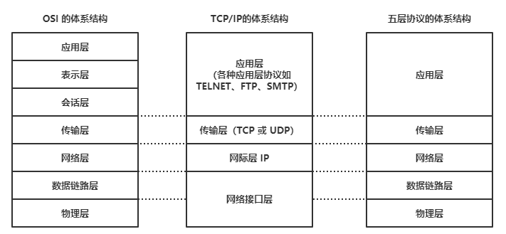

## dns

1. dns采用udp，端口53
2. dns查询分递归查询和迭代查询

## http请求和响应格式

1. http请求 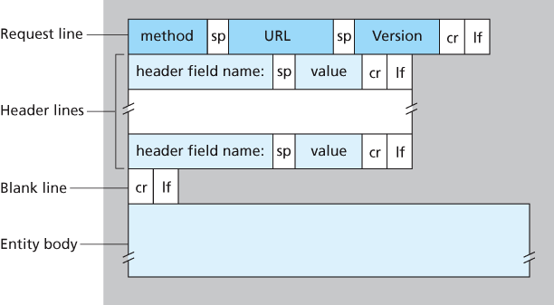
2. http响应 

## http状态码

1. 1xx 提示信息，一种中间状态，使用较少
2. 2xx 成功
   1. 200 OK
   2. 204 No Content
   3. 206 Partial Content
3. 3xx 重定向
   1. 301 Moved Permanently
   2. 302 Found
   3. 304 Not Modified
4. 4xx 客户端错误
   1. 400 Bad Request
   2. 403 Forbidden
   3. 404 Not Found
5. 5xx 服务端错误
   1. 500 Internal Server Error
   2. 501 Not Implemented
   3. 502 Bad Gateway
   4. 503 Service Unavailable

## http方法

1. GET 请求一个指定资源的表示形式. 使用GET的请求应该只被用于获取数据
2. HEAD 请求一个与GET请求的响应相同的响应，但没有响应体
3. POST 用于将实体提交到指定的资源，通常导致在服务器上的状态变化或副作用
4. PUT 用请求有效载荷替换目标资源的所有当前表示
5. DELETE 删除指定的资源
6. OPTIONS 用于描述目标资源的通信选项
7. TRACE 沿着到目标资源的路径执行一个消息环回测试
8. PATCH 用于对资源应用部分修改

## http 0.9 1.0 1.1 2.0 3.0

1. 0.9
   1. 仅有请求行，没有请求头和请求体；服务器返回没有响应头，仅有html文档
   2. 仅支持get和ascii字节流
2. 1.0
   1. 引入请求头和响应体
   2. 请求头中加入了 状态码 字段，通过响应行的方式来通知浏览器更新状态码
   3. 引入 Cache 缓存机制，用来缓存已经下载过的数据
   4. 在请求头中加入了 用户代理 字段，用来统计客户端数据
   5. 问题
      1. 每次 http 通信都需要建立 tcp 连接、http 传输和 断开 tcp 连接三个阶段，在传输数据越来越大的情况下花费了过大的性能开销
      2. 每个域名只能绑定唯一的 IP 地址，一个服务器只能支持一个域名
      3. 需要在响应头设置完整的数据大小（Content-Length: 901）方便浏览器根据数据大小来接受数据。所以在传输动态数据时会导致浏览器不知道数据何时传输结束
3. 1.1
   1. 增加持久连接（Connection:keep-alive\close），在一个 tcp 连接之上可以传输多个 http 请求，直到浏览器或者服务器明确要断开 tcp 连接为止（浏览器默认开启，对于同一域名，最多同时支持 6 个 tcp 持久连接，每个 tcp 连接同时只能发起一个 http 请求）
   2. 提供虚拟主机的支持，在一台单独的物理服务器中绑定多个虚拟主机，这些主机共用同一 IP 地址，并且在请求头中增加 Host 字段告诉物理服务器，真正请求的是机子上的那个虚拟机中的服务
   3. 通过引入 Chunk transfer 机制解决传输动态数据导致的问题，通过将数据分割传输，每个数据块的传输时附加上一次的数据块的长度（Content-Length: 0），如果为 0 时则表示传输完毕
   4. 问题
      1. 同时开启多条 tcp 连接，竞争固定带宽，且 tcp 无法确定哪些需要优先下载的关键资源
      2. 队头阻塞（在使用 tcp 持久连接时，多个 http 请求共用一个 tcp 连接管道，但是同一 tcp 连接管道中同时只能处理一个 http 请求，后续的需要排队等待管道队头的请求处理完毕）
4. 2.0
   1. 首部压缩
      1. web和server维护一份头部字典，将头部字段名对应一个字符
   2. 服务端主动推送利用带宽
      1. 不等到浏览器解析到需要某个资源在，而是服务器本身知道改页面需要的资源，在一次请求后主动推送
   3. 使用同一域名单 tcp 连接来规避 tcp 的慢启动和多连接竞争带宽的问题
   4. 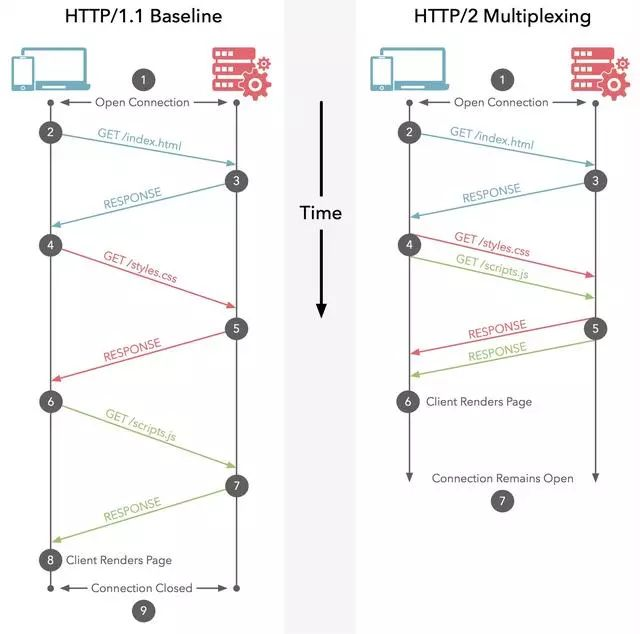使用多路复用机制（即一个tcp报文中可以包含两个请求的响应数据）实现资源的并行请求来解决 http/1.1 的 http 层级的队头阻塞问题（无法解决 tcp 数据包层级的队头阻塞）
   5. 在 http 和 tcp 层中间引入了二进制分帧层将 http 的请求数据拆分成带有 http 请求 ID 的多个 tcp 数据帧，服务器接收完所有该时刻同时发送的所有 http 请求的所有帧后（如何判断已经接收完了该 http 请求的所有帧），拼接 tcp 数据帧成一个完成的 http 请求，然后处理响应数据
   6. 问题
      1. tcp 层级的队头阻塞
         1. http/2 中，一个域名的多个请求经过二进制分帧层处理的后的 n 多个 tcp 数据包共用一个 tcp 连接管道进行传输，如果任意一个 tcp 数据包丢失则会暂停该 tcp 管道，等待丢失的包重新传输，此时就会阻塞所有请求
         2. http/1.1 会为每个域名同时开启最多 6 个 tcp 连接，即使一个 tcp 阻塞了，不会阻塞其他请求
      2. tcp 协议僵化（操作系统不能及时更新协议）
      3. 中间设备的僵化（更新tcp协议使得旧的传输设备无法解析，导致丢弃）
5. 3.0
   1. 基于udp实现quic

## session和cookie

1. session存在服务端，存放用户数据
   1. 当第一次连接后，服务端生成session和对应sessionID，将id响应给客户端
   2. 客户端之后的请求携带这个id（token）
2. session的客户端实现形式
   1. cookie
      1. 若不设置时间则浏览器关闭时sessionID就丢失，设置时间则会存在硬盘中
      2. cookie还保存了host信息，即一个网站只能读取自己的cookie
   2. url附加信息，如xxx.jsp?sessionid=xxxx
   3. 页面表单的隐藏信息，同上但改方法用post

## 断点续传

1. http1.1支持获取部分内容，使用Range头`Range: bytes=0-499` 表示第 0-499 字节范围的内容
2. 响应报文使用Content-Range标识当前接受的范围和文件总大小`Content-Range: bytes 0-499/22400`
3. 状态码为206
4. 使用Last-modified标识文件最后修改的时间，防止续传时，服务端上的文件被改变
   1. 客户端会通过 If-Modified-Since 头将先前服务器端发过来的 Last-Modified 最后修改时间戳发送回去，这是为了让服务器端进行验证，通过这个时间戳判断客户端的页面是否是最新的，如果不是最新的，则返回新的内容，如果是最新的，则返回 304 告诉客户端其本地 cache 的页面是最新的，于是客户端就可以直接从本地加载页面了，这样在网络上传输的数据就会大大减少，同时也减轻了服务器的负担
5. Etag（Entity Tags）主要为了解决 Last-Modified 无法解决的一些问题
   1. 一些文件也许会周期性的更改，但是内容并不改变（仅改变修改时间），这时候我们并不希望客户端认为这个文件被修改了，而重新 GET
   2. 某些文件修改非常频繁，例如：在秒以下的时间内进行修改（1s 内修改了 N 次），If-Modified-Since 能检查到的粒度是 s 级的，这种修改无法判断（或者说 UNIX 记录 MTIME 只能精确到秒）。
   3. 某些服务器不能精确的得到文件的最后修改时间

## https

1. https流程
   1. client hello
      1. 客户端支持的 SSL/TLS 协议版本
      2. 客户端生产的随机数（Client Random），后面用于生产「会话秘钥」
      3. 客户端支持的密码套件列表，如 RSA 加密算法
   2. server hello
      1. 确认 SSL/ TLS 协议版本，如果浏览器不支持，则关闭加密通信
      2. 服务器生产的随机数（Server Random），后面用于生产「会话秘钥」
      3. 确认的密码套件列表，如 RSA 加密算法
      4. 服务器的数字证书
   3. 客户端回应
      1. 验证证书，若成功则进行一下步骤
      2. 一个随机数（pre-master key）该随机数会被服务器公钥加密
      3. 加密通信算法改变通知，表示随后的信息都将用「会话秘钥」加密通信
      4. 客户端握手结束通知，表示客户端的握手阶段已经结束，这一项同时把之前所有内容的发生的数据做个摘要，用来供服务端校验
   4. 服务器最后回应
      1. 加密通信算法改变通知，表示随后的信息都将用「会话秘钥」加密通信
      2. 服务器握手结束通知，表示服务器的握手阶段已经结束，这一项同时把之前所有内容的发生的数据做个摘要，用来供客户端校验
2. https加密算法
   1. 使用非堆成加密RSA加密会话密钥
   2. 后续使用加密后密钥对内容进行对称加密，如DES
   3. 两种加米权衡了安全和效率
3. CA（证书认证机构）
   1. 证书的签发和验证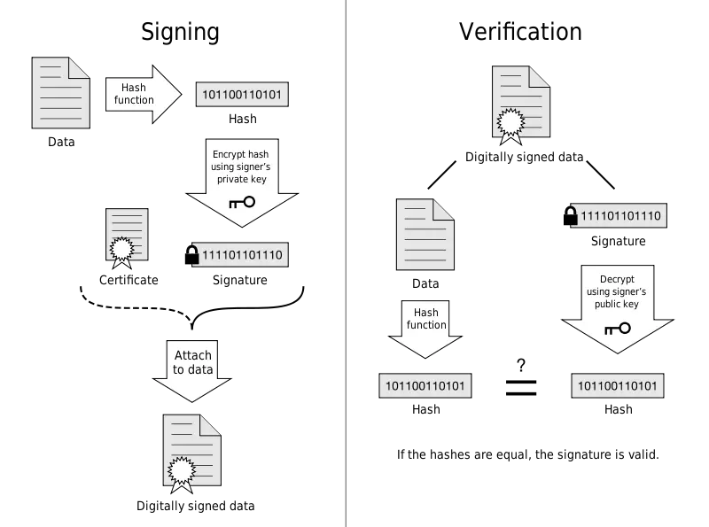
      1. Signing阶段，首先撰写证书的元信息：签发人(Issuer)、地址、签发时间、过期失效等；当然，这些信息中还包含证书持有者(owner)的基本信息，例如owner的DN(DNS Name，即证书生效的域名)，owner的公钥等基本信息。
      2. 通过通用的Hash算法将信息摘要提取出来；
      3. Hash摘要通过Issuer(CA)私钥进行非对称加密，生成一个签名密文；
      4. 将签名密文attach到文件证书上，使之变成一个签名过的证书
   2. 浏览器和操作系统内置了信任的ca的公钥，用于验证证书
   3. 证书链
      1. ca其实是一个层级关系，可以链式查询上层的的ca是否合法

## rsa和des

1. rsa
   1. RSA加密利用了单向函数正向求解很简单，反向求解很复杂的特性
   2. 随机找两个质数 P 和 Q ,P 与 Q 越大，越安全
   3. 计算 n=p*q 的欧拉函数m = φ(n)，φ(n) 表示在小于等于 n 的正整数之中，与 n 构成互质关系的数的个数
   4. 随机选择一个整数 e，条件是1< e < m，且 e 与 m 互质
   5. 有一个整数 d，可以使得 e*d 除以 m 的余数为 1
   6. 公钥为(n,e) 私钥为(n,d)
   7. 加密为 cipher = text^e % n
   8. 解密为 text = cipher^d % n

## udp头部

1. udp头部

## tcp封包

1. 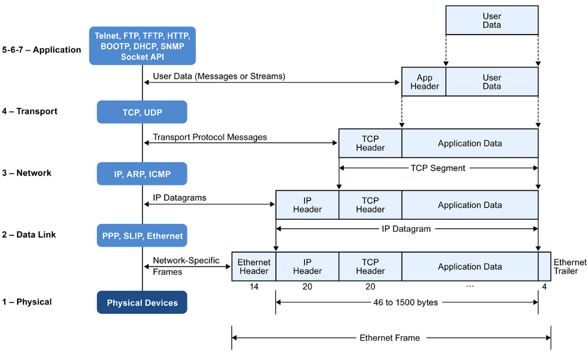

## tcp头部

1. tcp头部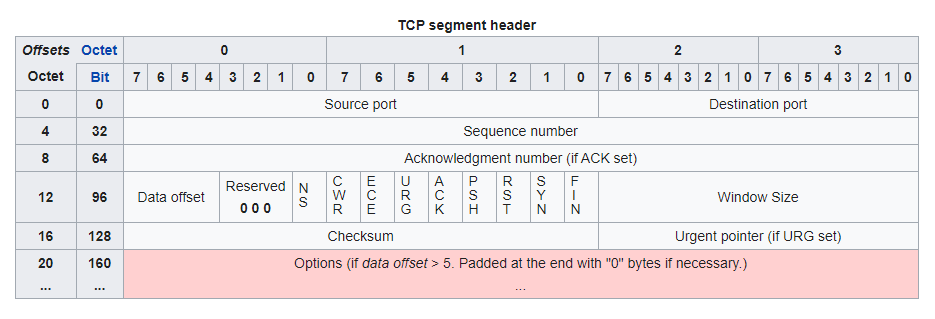
   1. 5 <= data offset <= 15，单位32-bits words，tcp最小20B最大60B=20B+40B选项
2. tcp options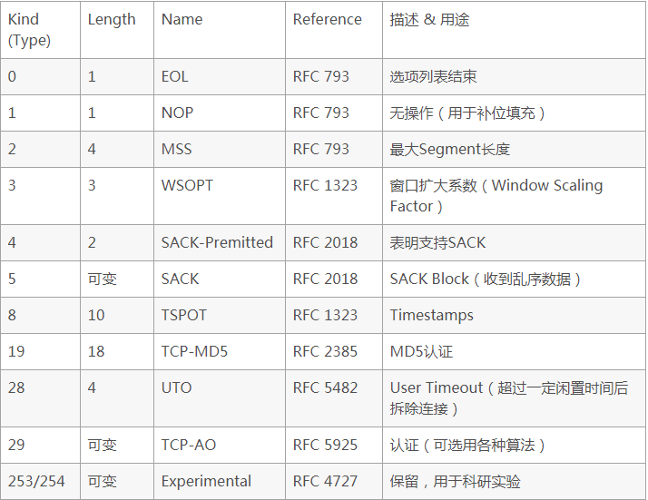

## tcp状态

1. 

## tcp三次握手和四次挥手

1. 3此握手4次挥手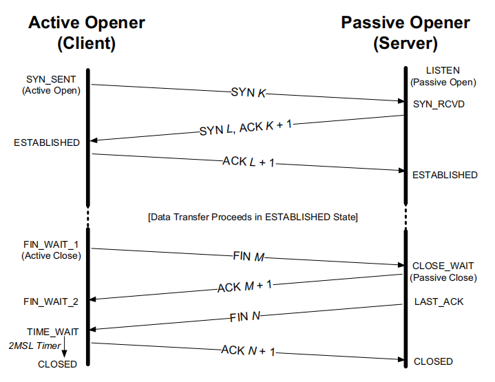
2. 为什么3次握手
   1. 防止重复的历史连接；如果是历史连接到达服务端，服务端返回ack后客户端根据自己的上下文（序列号或时间）判断出该连接非本次连接，发送RST给服务端终止
   2. 同步初始化双方序列号；两次握手进能保证一方的seq被成功接收
   3. 避免资源浪费；两次握手若客户端发送syn后未收到ack，会重新发送，服务端因为无法知道客户端是否已经收到ack，导致每个syn都会建立一个连接产生多个无效连接
3. 为什么四次挥手
   1. tcp是全双工的，任何一方可以关闭单方向的数据传输
4. 为什么有time_wait并等待2MSL
   1. MSL是报文最大生存时间，2MSL保证本次连接（由ip:port四元组确定）的数据包在网络中消失，因为下次连接可能使用相同的四元组
   2. 保证被动关闭方能收到fin的ack；被动关闭方超时未收到ack重发，这次重发一个来回的时间 <= 2MSL；主动关闭方每次收到fin重启2MSL计时

## tcp可靠传输

1. 校验和
   1. tcp伪头部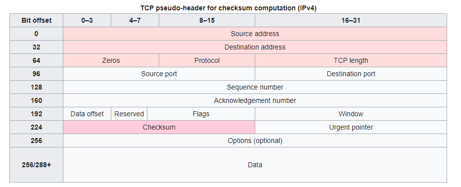
   2. 计算校验和时使用伪首部，伪首部仅用来计算校验和，并不真正传递
2. seq和ack机制
3. 重传
   1. 超时重传
      1. RTT（Round-Trip Time）数据包往返时间，从发送开始计时到收到ACK
      2. RTO（Retransmission Timeout）略大于RTT
      3. 较小RTO可能导致频繁重发，增加网络拥塞又导致更多重发；较大RTO重发时间慢没有效率
      4. 如果超时重发的数据再次超时，超时时间间隔加倍
   2. 快重传
      1. 收到连续三个相同ACK就重传，不必等待超时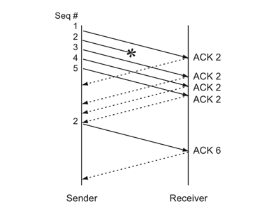
      2. SACK可确定是仅重传部分还是所有都需要重传
         1. 在TCP头部的选项字段中添加SACK，可将已缓存的数据信息发送给对方
         2. SACK kind=4，用于告知对方本方是否支持SACK，可在握手时添加该选项；SACK kind=5用于数据传输
         3. SACK选项本身占2B（kind+length）；后面每个块占8B（两个32位数标识未确认的seq的范围）
         4. D-SACK用来区分到底是数据丢失还是ACK丢失
            1. 如果SACK的第一个段的范围被ACK所覆盖，那么就是D-SACK
            2. 如果SACK的第一个段的范围被SACK的第二个段覆盖，那么就是D-SACK

## tcp流量控制

1. 滑动窗口
   1. tcp头部有window size字段，告知对方自己可接受的最大数据量
   2. 发送方的滑动窗口
      1. 已发送已ack
      2. 已发送未ack
      3. 未发送（因为超过接收方窗口大小）
   3. 接收方的滑动窗口
      1. 已收到已ack
      2. 已收到未ack
      3. 未收到
   4. 当接收方窗口大小为0时，即为窗口关闭；发送方设定计时器主动探查接收方是否有可用窗口
2. 糊涂窗口
   1. 即发送方仅有很小的接收空间，发送方依然发送数据，导致除去TCP+IP头部后有效载荷其实很小
   2. 发送端解决 -> nagle
      1. 当窗口大小>=MSS 或 数据大小>=MSS 发送
      2. 当收到之前ack时发送下一个包
   3. 接收端解决 -> delay-ack
      1. 当仅有ack需要发送时，则等待一段时间 200ms
      2. 当有响应数据要发送则立即返回ack和数据
      3. 当对方新包到达则立即返回上一个包的ack

## tcp拥塞控制

1. 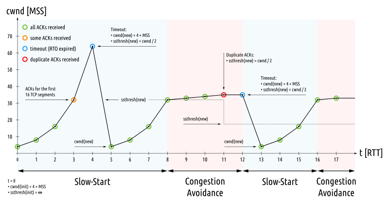
2. 慢启动
   1. 建立连接后$cwnd = 1$在收到一个ack后$cwnd = cwnd * 2$
   2. 当$cwnd >= ssthresh(slow start threshold)$后进入拥塞避免
3. 拥塞避免
   1. 每收到一个ack $cwnd += 1 /cwnd$
4. 拥塞发生
   1. 超时重传 -> 再次从慢启动开始
   2. 收到3次重复ack -> 快恢复
      1. 收到3个重复ack说明网路不是特别拥塞；
      2. 在进入快恢复前$cwnd = cwnd / 2; ssthresh = cwnd$
      3. 进入快恢复时，拥塞窗口$cwnd = ssthresh + 3$

## tcp粘包

1. TCP 协议是基于字节流的传输层协议，其中不存在消息和数据包的概念
2. 应用层协议没有使用基于长度或者基于终结符的消息边界，导致多个消息的粘连

## tcp和udp区别

1. tcp面向连接；udp无连接
2. tcp是字节流；udp是数据报
3. tcp可靠传输；udp不可靠
4. tcp有流量控制，拥塞控制；udp无
5. tcp自己分片；udp需要ip层分片
6. tcp首部开销20B；udp 8B

## ip地址分类

1. 经典分类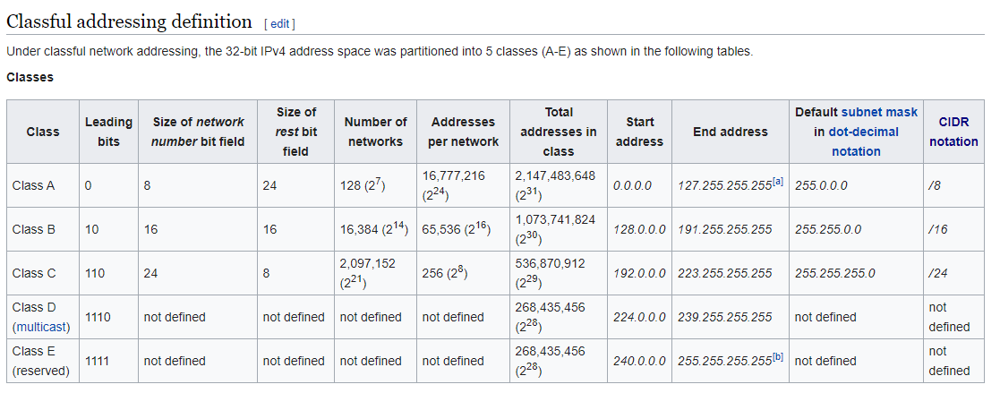
2. 特殊用途的ip
3. VLSM变长子网掩码
   1. A B C类分类已经不再实用，不再区分
   2. VLSM用于划分子网
   3. VLSM可以将部分host号用作子网号（/25，相当于一位用作子网划分，创建两个子网）
4. CIDR（Classless Inter-Domain Routing）无类别域间路由
   1. CIDR用于减少路由表项，伴随VLSM产生
   2. route aggregation 

## 子网

1. 子网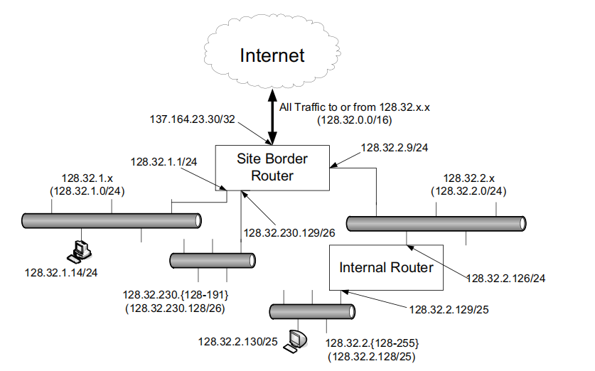

## NAT

1. NAT
2. nat分类
   1. 基础nat
      1. 一个ip对应一个ip，并不能减少ip数量
   2. NAPT 网络地址端口转换
      1. 当内网主机访问外网时，NAT选择空闲的外网ip:port与内网ip:port对应建立表项
      2. 修改包的源地址为nat的源ip后发出

## ip头部

1. ip头部

## ip分片与重组

1. 
2. 分片
   1. 当数据大小 > MTU 时进行
   2. 分割后的每个包，头部基本相同（id，srcip，desip等相同，长度不同），数据被分割
3. 重组
   1. 根据相同的id进行重组
   2. 若一个分片丢失
      1. 超时后所有其他分片均被丢弃
      2. 需要重传整个包
4. 避免分片
   1. tcp是由MSS = MTU - IP header - TCP header设置
   2. udp手动分割，数据大小 <= 1472 = mtu 1500 - ip 20 - udp 8

## 路由表

```bash
$ route
Kernel IP routing table
Destination     Gateway         Genmask         Flags Metric Ref    Use Iface
default         10.0.2.2        0.0.0.0         UG    0      0        0 enp0s3
10.0.2.0        0.0.0.0         255.255.255.0   U     0      0        0 enp0s3
link-local      0.0.0.0         255.255.0.0     U     1000   0        0 enp0s3
192.168.56.0    0.0.0.0         255.255.255.0   U     0      0        0 enp0s8

# gateway is the next hop address
# U -> the route is up
# G -> the route is a gateway
# H -> the route is a host
```

## 路由的建立

1. 静态路由
   1. 手动设置
2. 动态路由
   1. RIP
      1. 采用距离向量方式
      2. 仅与相邻路由器交换
      3. 交换路由表，目的ip，最短距离，下一跳ip
      4. 缺点
         1. 无法区分非零部分是否是子网
         2. 可能发生环路
         3. 度量为16限制了网络大小
   2. OSPF
      1. 是一个链路状态协议

## 路由器转发

1. 路由器收到报文后，将报文从物理层送至链路层得到 des mac addr
   1. 如果是本机 mac，将报文送至网络层解析
   2. 非本机mac，丢弃
2. 网络层取出 des ip
   1. 是本机 ip，送至传输层解析
   2. 非本机 ip，查找路由表，得到出口
3. 查找路由表时
   1. 选路（匹配）规则
      1. 最长匹配原则
      2. 管理距离（由RIP或OSPF获取得到的表项的优先级不同，如OSPF优先于RIP）
      3. metric最小
   2. 若匹配直连路由，网络层封装 src ip 和 des ip，链路层封装 des ip 对应 mac （arp获得）
   3. 若匹配非直连路由（默认路由），网络层封装 src ip 和 des ip，链路层封装下一跳 ip 对应 mac （arp获得）
   4. 若无匹配，丢弃报文，并向 src ip 返回目标不可达 ICMP报文

## arp表

```bash
$ arp
Address                  HWtype  HWaddress           Flags Mask            Iface
10.0.2.2                 ether   52:54:00:12:35:02   C                     enp0s3
192.168.56.1             ether   0a:00:27:00:00:05   C                     enp0s8
169.254.169.254                  (incomplete)                              enp0s3
```

## arp过程

1. 有 ip：mac 对应直接返回
2. 否则
   1. 广播查询ip所对应的mac
   2. 被广播的主机收到该查询后
      1. 若ip匹配则返回自己对应网卡的mac
      2. 否则丢弃该查询
   3. 将查询结果缓存至arp表
3. arp表项具有时间限制，会被定时清理

## 浏览器中输入后的过程

1. 判断是否是url或是搜索
2. 构造http请求
3. 封装tcp
   1. src port随机，des port为80/443
4. 封装ip
   1. src ip为本机ip
      1. 若有多个网卡（ip）根据出口选择网卡（路由表），src ip为对应网卡ip
   2. des ip由dns获取：浏览器缓存 -> 操作系统缓存 -> 运营商缓存 ->递归/迭代查询
5. 封装链路
   1. 在arp表中，根据ip查询mac
   2. src mac 为网卡地址，des mac为下一跳ip对应的网络设备mac
6. 网卡发送
   1. 驱动程序将MAC包拷贝到网卡内部的缓存区
   2. 网卡对MAC包添加头部同步信息和CRC校验，再次封装成物理帧，然后丢到网线上
7. 网卡接受
   1. 网卡检查MAC包内的目的MAC地址信息，和本网卡的MAC地址是否一致？不一致，抛弃
   2. 网卡将MAC帧拷贝到网卡内部的缓冲区，触发中断
   3. 驱动程序通过中断，将MAC包拷贝到系统中，构建sk_buff，告诉上层
   4. 上层继续解析（可能ip非本机，继续转发）
8. 浏览器最终接受响应并渲染

## io复用

1. IO模型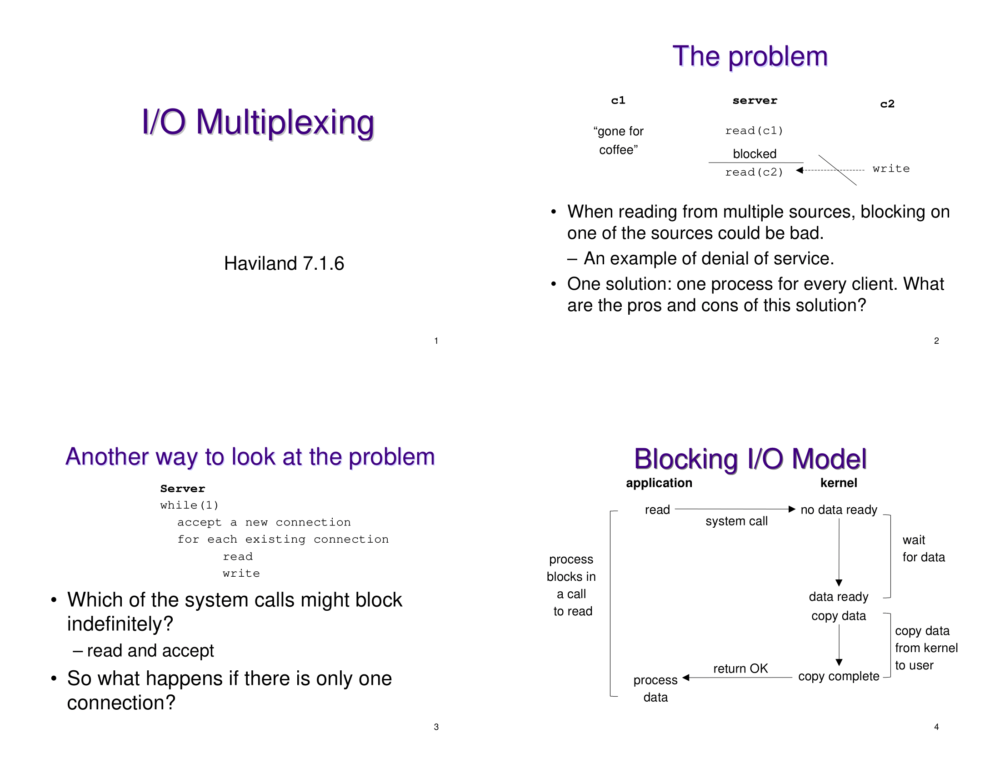 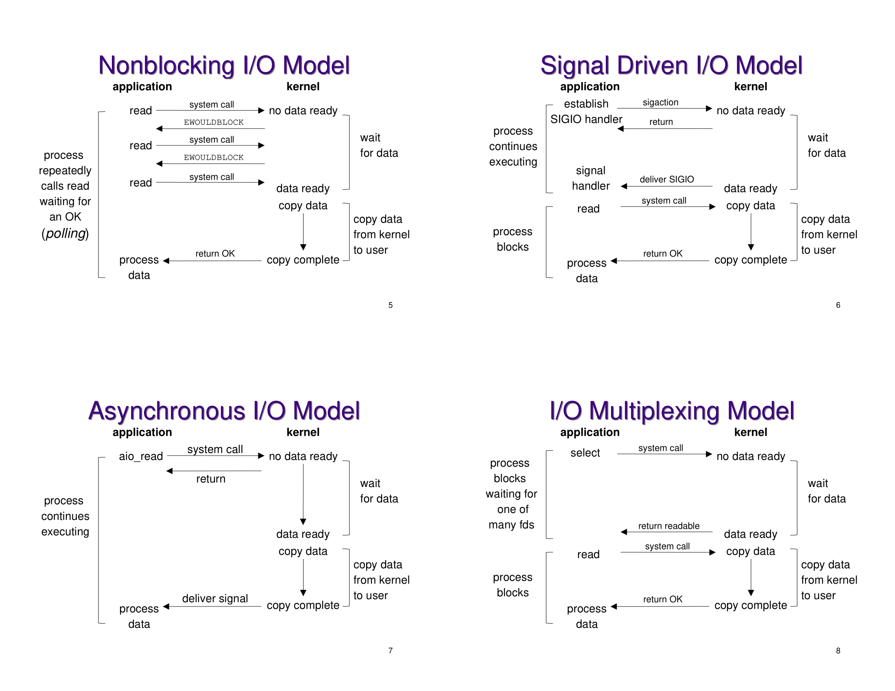

## select poll epoll

```cpp
void FD_CLR(int fd, fd_set *set);
int FD_ISSET(int fd, fd_set *set);
void FD_SET(int fd, fd_set *set);
void FD_ZERO(fd_set *set);
int select(int nfds, fd_set *readfds, fd_set *writefds, fd_set *exceptfds,
           struct timeval *timeout);

struct pollfd {
  int fd;        /* file descriptor */
  short events;  /* requested events */
  short revents; /* returned events */
};
int poll(struct pollfd *fds, nfds_t nfds, int timeout);

typedef union epoll_data {
  void *ptr;
  int fd;
  uint32_t u32;
  uint64_t u64;
} epoll_data_t;

struct epoll_event {
  uint32_t events;   /* Epoll events */
  epoll_data_t data; /* User data variable */
};
int epoll_create(int size);
int epoll_create1(int flags);
int epoll_ctl(int epfd, int op, int fd, struct epoll_event *event);
int epoll_wait(int epfd, struct epoll_event *events, int maxevents,
               int timeout);
```

1. select
   1. 流程
      1. 定义一个fd_set
      2. FD_ZERO()清空
      3. FD_SET()添加listen_fd（bind，listen）
      4. select()其中nfds=maxfd+1
      5. select返回后遍历，判断FD_ISSET()；若是listen_fd，FD_SET添加新accept()的fd；若是其fd他则读取数据
      6. select返回后，会将之前已加入fd_set但无事件发生的fd清空，每次select前fd都需重新加入
2. poll
   1. 流程
      1. 获取listen_fd
      2. 建立pollfd数组，用于存放client连接关心的events，将listen_fd加入数组并设置events为POLLIN
      3. poll()
      4. poll返回后遍历，若是listen_fd则accept添加一个fd，并设置相应events（POLLIN）；若是其他fd则根据revents处理
3. epoll
   1. 流程
      1. 获取listen_fd
      2. epoll_create()创建epollfd
      3. epoll_ctl()将listen_fd加入且对应epoll_event为EPOLLIN
      4. epoll_wait()
      5. epoll_wait返回后，仅发生events的fd会被返回在events中，遍历即可
   2. 事件
      1. EPOLLIN 表示对应的文件描述符可以读（包括对端SOCKET正常关闭
      2. EPOLLOUT 表示对应的文件描述符可以写
      3. EPOLLPRI 表示对应的文件描述符有紧急的数据可读（这里应该表示有带外数据到来）
      4. EPOLLERR 表示对应的文件描述符发生错误
      5. EPOLLHUP 表示对应的文件描述符被挂断
      6. EPOLLRDHUP：对端关闭了套接字，或者对端关闭了写
      7. EPOLLET 将 EPOLL设为边缘触发(Edge Triggered)模式（默认为水平触发），这是相对于水平触发(Level Triggered)来说的
      8. EPOLLONESHOT 只监听一次事件，当监听完这次事件之后，如果还需要继续监听这个socket的话，需要再次把这个socket加入到EPOLL队列里
4. 三者区别
   1. select最大描述符一般1024，poll epoll 是进程可打开的最大fd数量
   2. select poll都需要循环遍历O(n)，epoll回调 O(1)
   3. select poll仅有LT模式，epoll还有ET模式；LT与ET模式的区别为，LT模式在有事件时会一直返回，ET只返回一次；如同一时刻多个连接到达，使用ET模式时，需要用while包裹accept直到EAGAIN或EWOULDBLOCK，否则只会有一个连接建立
   4. epoll使用，mmap用户和内核共享epollfd，减少数据拷贝；红黑树存储fd；网卡驱动程序的callback向双向链表rd_list添加ep_item，epoll_wait根据双链表是否非空返回

## epoll的lt与et

1. 水平触发，效率会低于ET触发，尤其在大并发，大流量的情况下。但是LT对代码编写要求比较低，不容易出现问题。LT模式服务编写上的表现是：只要有数据没有被获取，内核就不断通知你，因此不用担心事件丢失的情况
2. 边缘触发，效率非常高，在并发，大流量的情况下，会比LT少很多epoll的系统调用，因此效率高。但是对编程要求高，需要细致的处理每个请求，否则容易发生丢失事件的情况
3. 与LT相比，ET模型是通过减少系统调用来达到提高并行效率的
4. ET模式为什么要设置在非阻塞模式下工作
   1. 因为ET模式下的读写需要一直读或写直到出错（对于读，当读到的实际字节数小于请求字节数时就可以停止），而如果你的文件描述符如果不是非阻塞的，那这个一直读或一直写势必会在最后一次阻塞。这样就不能在阻塞在epoll_wait上了，造成其他文件描述符的任务饥饿

## 服务端客户端函数

```cpp
struct sockaddr {
  sa_family_t sa_family;
  char sa_data[14];
}
struct sockaddr_in {
  sa_family_t sin_family;  /* address family: AF_INET */
  in_port_t sin_port;      /* port in network byte order */
  struct in_addr sin_addr; /* internet address */
};
int bind(int sockfd, const struct sockaddr *addr, socklen_t addrlen);
int listen(int sockfd, int backlog);
int accept(int sockfd, struct sockaddr *addr, socklen_t *addrlen);


int connect(int sockfd, const struct sockaddr *addr, socklen_t addrlen);

int getsockopt(int sockfd, int level, int optname, void* optval,
               socklen_t* optlen);
```

1. 
2. listen
3. connect
   1. 再第二次握手返回syn+ack后connect正常返回
   2. 常见的错误值，syn_recv队列已满返回timeout；服务器没有监听响应地址端口返回econnrefused；中间某个路由返回错误icmp返回ehostunreach或enetunreach
4. accept
   1. accpet发生在三次握手之后，仅仅从队列中取出已连接
5. shutdown/close

## 实现一个带超时的connect

1. 将sockfd设置成noblocking，如果connect返回0说明建立连接成功，如果返回-1且错误为EINPROCESS说明还在连接
2. 使用select并设置timeout，在select返回后使用getsockopt在SOL_SOCKET层判断SO_ERROR是否有错误（0为正常）

## socket编程tcp选项

1. SO_REUSEADDR
   1. 改变通配绑定时处理源地址冲突的处理方式，可以先绑定特殊192.168.0.1:21再绑定通配0.0.0.0:21
   2. 处于TIME_WAIT的addr可以被绑定成功
2. SO_REUSEPORT
   1. 允许多个socket绑定到相同的addr和port
   2. 内核会对新的连接在所有绑定的socket间做负载均衡
3. SO_LINGER
   1. 用来设置关闭时的具体动作
   2. l_onoff非0为开启改选项，l_linger为0，直接发送rst关闭，非0，如果socket中有未发送的数据，进程睡眠，内核在超时时间内尽可能发送，若超时前发完，则正常关闭，否则直接关闭，close返回EWOULDBLOCK

## 惊群效应

1. 惊群效应指当多线程或多进程同时阻塞等待同一个事件时，如果这个事件发生，那么所有线程会被唤醒，但仅有一个线程获得控制权，其他线程重新进入等待；如nginx中worker是master的子进程都有listen_fd，当一个连接到达时所有都被唤醒，nginx使用accept_mutex解决
2. 惊群效应的问题；线程的无效调度，上下文切换影响性能
3. 解决；加锁
4. accept()无惊群
5. epoll()有惊群

## 大量time_wait

1. 主动关闭方才具有time_wait状态
2. 可能原因是客户端频繁的连接和断开
3. 大量time_wait会占用，内存，cpu，src port，fd

## 大量close_wait

1. 被动关闭方才具有close_wait状态
2. 可能原因是socket关闭不及时

## reactor和proactor

1. reactor
   1. 读操作
      1. 应用程序注册读就绪事件和相关联的事件处理器（fd,callback）
      2. 事件分离器等待事件的发生（epoll）
      3. 当发生读就绪事件的时候，事件分离器调用第一步注册的事件处理器（thread use callback）
      4. 事件处理器首先执行实际的读取操作，然后根据读取到的内容进行进一步的处理（read and process）
   2. 写操作
      1. 同上
2. proactor
   1. 读操作
      1. 应用程序初始化一个异步读取操作，然后注册相应的事件处理器，此时事件处理器不关注读取就绪事件，而是关注读取完成事件，这是区别于Reactor的关键
      2. 事件分离器等待读取操作完成事件
      3. 在事件分离器等待读取操作完成的时候，操作系统调用内核线程完成读取操作（异步IO都是操作系统负责将数据读写到应用传递进来的缓冲区供应用程序操作，操作系统扮演了重要角色），并将读取的内容放入用户传递过来的缓存区中。这也是区别于Reactor的一点，Proactor中，应用程序需要传递缓存区
      4. 事件分离器捕获到读取完成事件后，激活应用程序注册的事件处理器，事件处理器直接从缓存区读取数据，而不需要进行实际的读取操作
   2. 写操作
      1. 同上
3. Reactor和Proactor模式的主要区别就是真正的读取和写入操作是有谁来完成的，Reactor中需要应用程序自己读取或者写入数据，而Proactor模式中，应用程序不需要进行实际的读写过程，它只需要从缓存区读取或者写入即可，操作系统会读取缓存区或者写入缓存区到真正的IO设备

## nginx热升级

1. 升级
   1. 将旧nginx二进制文件换成新的nginx二进制 文件(注意备份)
   2. 向master进程发送USR2信号 `kill -USR2 6965`
   3. master进程修改pid文件名，加后缀.olidbin
   4. master进程用新nginx文件启动新master进程
   5. 向老master进程发送WINCH/QUIT信号，关闭老master进程`kill  -QUIT 6965`
2. 回滚
   1. 向老master发送HUP，向新master发送QUIT

## nginx 负载均衡

1. 轮询模式（默认） 每个请求按时间顺序逐一分配到不同的后端服务器，如果后端服务器down掉，能自动剔除
2. 权重模式 指定轮询几率，weight和访问比率成正比，用于后端服务器性能不均的情况
3. IP_hash模式 （IP散列） 每个请求按访问ip的hash结果分配，这样每个访客固定访问一个后端服务器，可以解决session的问题
4. url_hash模式
5. fair模式 按后端服务器的响应时间来分配请求，响应时间短的优先分配

## nginx进程模型

1. master-worker模式，一个master进程和至少一个的worker进程
2. 单进程模式，单进程模式顾名思义只有一个进程

## nginx锁

1. nginx的master在listen后fork这样每个子进程都有listenfd
2. 这样一个连接到来所有worker都会唤醒（惊群，其他的可能accept失败，在linux2.6后accept不惊群，但是使用epoll_wait等待listenfd会有惊群）
3. 仅获得accept_mutex的worker接受这个链接
   1. accept是一个全局变量，通过共享内存是的多进程都可见

## nginx为什么多进程而非多线程

1. Nginx 要保证它的高可用 高可靠性, 如果Nginx 使用了多线程的时候,由于线程之间是共享同一个地址空间的,当某一个第三方模块引发了一个地址空间导致的断错时 (eg: 地址越界), 会导致整个Nginx全部挂掉; 当采用多进程来实现时, 往往不会出现这个问题

## protobuf

1. Protocol Buffers 是一种轻便高效的结构化数据存储格式，可以用于结构化数据序列化，很适合做数据存储或 RPC 数据交换格式。它可用于通讯协议、数据存储等领域的语言无关、平台无关、可扩展的序列化结构数据格式

## 常见网络攻击

1. ddos
2. xss（跨站脚本攻击）
   1. 比如在留言板中留言`<script>alert(“hey!you are attacked”)</script>`，之后打开会执行这个js
   2. 解决
      1. 替换<>等字符，注意包括大小写，注意xss使用eval()和字符编码，注意不存在连接后的错误处理函数
3. csrf（跨站请求伪造）
   1. 银行网站A，它以GET请求来完成银行转账的操作，如：http://www.mybank.com/Transfer.php?toBankId=11&money=1000
   2. 危险网站B，它里面有一段HTML的代码如下：
   3. ``
   4. `首先，你登录了银行网站A，然后访问危险网站B，噢，这时你会发现你的银行账户少了1000块`
   5. 防御
      1. 同源检测，http的refer字段标识请求来源，需要同一网站
      2. 用户打开页面的时候，服务器需要给这个用户生成一个Token，该Token通过加密算法对数据进行加密，一般Token都包括随机字符串和时间戳的组合，显然在提交时Token不能再放在Cookie中了，否则又会被攻击者冒用。因此，为了安全起见Token最好还是存在服务器的Session中，之后在每次页面加载时，使用JS遍历整个DOM树，对于DOM中所有的a和form标签后加入Token。这样可以解决大部分的请求，但是对于在页面加载之后动态生成的HTML代码，这种方法就没有作用，还需要程序员在编码时手动添加Token