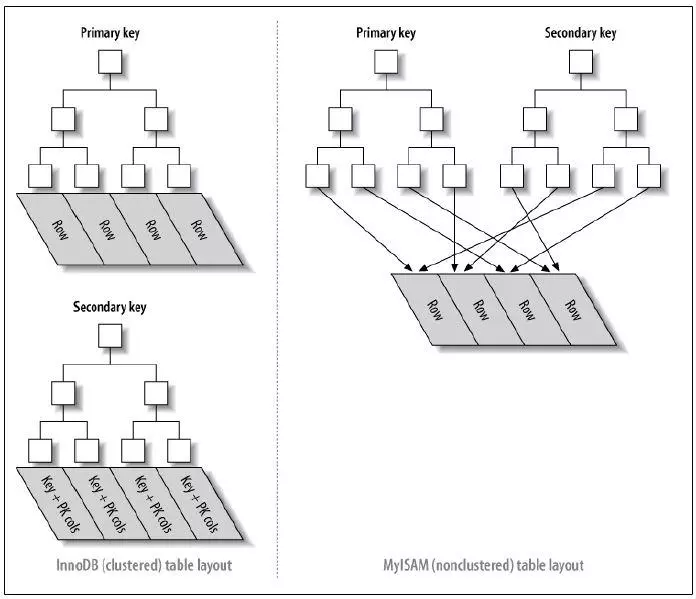

# Database

## 事务特性

1. Atomicity
2. Consistent
3. Isolate
4. Durable

## 数据库范式

1. 1NF 列是原子的
2. 2NF 非主属性不能部分依赖主属性
3. 3NF 非主属性间不存在传递依赖

## 脏读，不可重复读，幻读

1. 脏读，A事务还没提交时B事务读取，之后A回滚，B读到脏数据
2. 不可重复读，A事务中会读某个数据多次，B事务在期间修改了数据，A两次读到同一个数据不一致
3. 幻读，A事务修改表中全部数据时，B事务添加了一条数据，A之后发现表中还有未修改数据

## 隔离级别

1. 读未提交
2. 读已提交，解决脏读
3. 可重复读，解决不可重复读
4. 串行化，解决幻读

## 各隔离级别加锁情况

1. read uncommitted 读不加锁，写排他锁
2. read committed 每次读mvcc都生成快照，在快照中索引
3. repeatable read 一次事务只在第一次select生成快照（因为快照只对读操作有效，对写操作无效，所以存在幻读）
4. serialisable 读写均排他锁

## 乐观锁和悲观锁

1. 乐观锁，每次取数据时认为别人都不会修改，所以不上锁，当提交更新时会判断期间数据有无被他人修改
   1. 数据版本，为表增加一个version字段，当读数据时将version字段值一同读出，每次更新数据version+1，当提交时比对version是否过期
   2. 时间戳，添加timestamp字段类型，其他同上
2. 悲观锁，每次修改数据时都获得锁

## Innodb的两种行级锁

1. s锁，共享，允许事务读取一行数据
2. x锁，排他，允许事务更改一行数据

## innodb三种行锁算法实现隔离级别

1. record locks，锁定索引上的单个记录，若未定义索引，innodb会隐式创建一个聚族索引，并引用改索引锁定记录
2. gap locks，锁定一个范围<>
3. next-key locks，以上的结合，即锁定范围又锁定本身<= =>

## mysql的引擎

1. INNODB
2. MYISAM

## innodb和myisam区别

1. InnoDB 支持事务，MyISAM 不支持事务，这是 MySQL 将默认存储引擎从 MyISAM 变成 InnoDB 的重要原因之一
2. InnoDB 支持外键，而 MyISAM 不支持
3. InnoDB 是聚集索引，MyISAM 是非聚集索引
4. InnoDB 不保存表的具体行数，执行 select count(*) from table 时需要全表扫描。而MyISAM 用一个变量保存了整个表的行数，执行上述语句时只需要读出该变量即可，速度很快
5. InnoDB 最小的锁粒度是行锁，MyISAM 最小的锁粒度是表锁。一个更新语句会锁住整张表，导致其他查询和更新都会被阻塞，因此并发访问受限。这也是 MySQL 将默认存储引擎从 MyISAM 变成 InnoDB 的重要原因之一

## 聚族索引和非聚族索引

1. 
2. 聚族索引
   1. 数据和索引放在一起
   2. 一个表仅有一个聚族索引，默认为主键，未定义主键时innodb选择一个唯一的非空索引代替，若没有innodb隐式定义一个主键
3. 非聚族索引
   1. 数据和索引分离，得到数据要回表查询

## 二级索引

1. 二级索引即辅助索引
2. 二级索引最终只能拿到主键id，获取内容还需回表
3. 只需要使用到二级索引的查询，不需要进行回表操作的方式称为覆盖索引
   1. 再有索引idx_author_name时，`select id,author,name from book where author = 'author1';`不回表
   2. `select * from book where author='author1';` select * 会回表

## 索引的实现

1. B树 / B+树
   1. B树每个节点可以有多个子树，这样一个节点的内容多，树的层数低，有利于磁盘IO（磁盘每次IO会预读，一次可取到一个节点的内容，减少IO次数）
   2. B+树节点只有索引，层数更低，且每次查询都会落到叶子节点，查询稳定
   3. B+树叶子节点有指向右边兄弟的指针，且最后一层数据按索引排列，这样找到起始节点就可以一直向后读到范围结束
2. hash
   1. hash索引查找 O(1)
   2. hash索引只能用来 = IN <= >=，不能用来范围查询

## 最左匹配原则

1. mysql可以建立联合索引（多列的索引）
2. 如果你创建一个联合索引, 那 这个索引的任何前缀都会用于查询, (col1, col2, col3)这个联合索引的所有前缀 就是(col1), (col1, col2), (col1, col2, col3), 包含这些列的查询都会启用索 引查询.
3. 其他所有不在最左前缀里的列都不会启用索引, 即使包含了联合索引里的部分列 也不行. 即上述中的(col2), (col3), (col2, col3) 都不会启用索引去查询

## mysql模糊查询

1. SELECT 字段 FROM 表 WHERE 某字段 Like 条件
   1. % 匹配任意个字符
   2. _ 匹配单个字符
2. SELECT 字段 FROM 表 WHERE 某字段 REGEXP 正则表达式

## 模糊查询与索引

1. like %keyword 索引失效
   1. 因为任何字符可以匹配 % 无法查找
   2. 可逆序后使用索引，`select * from xxx where mobile_reverse like reverse('%5678');` mobile_reverse存储mobile的倒叙文本
2. like keyword% 索引有效
3. like %keyword% 索引失效，也无法反向索引

## mysql主从复制

1. 做数据热备，当主库挂掉切换到从库
2. 原理
   1. 主数据库的更新事件（update，insert，delete）等事件被写入binlog
   2. 从库连接主库
   3. 主库新建线程，将binlog发送到从库
   4. 从库启动后创建io线程将binlog内容写入到relay log
   5. 从库创建线程从realylog中，从exec_master_log_pos开始执行命令

## 主从延迟

## 复制方式

1. 同步复制，等待所有从库复制后主库返回客户端
2. 异步复制，主库执行完请求后理解返回，不等待从库是否接收并执行完
3. 半同步复制，当有一个从库复制后，主库放回客户端

## mysql命令

1. 按条件计数
   1. `SELECT COUNT(*) FROM `students` GROUP BY `class_id` > 25;`
   2. `SELECT COUNT(*) AS `number`, `class_id` > 25 AS `type` FROM `students` GROUP BY `class_id` > 25;`

## redis缓存穿透，缓存击穿和缓存雪崩

1. 缓存穿透
   1. 访问不存在的key，每次请求落在数据库，高并发时挂掉
   2. 解决，直把null设为缓存
2. 缓存击穿
   1. 大量数据访问同一个key（如秒杀），缓存过期的瞬间大量请求落在数据库
   2. 解决，不过期
3. 缓存雪崩
   1. 大量key同时过期
   2. 解决：随机key的过期时间；热点数据考虑不失效

## redis单线程为什么快

1. 纯内存操作
2. 单线程避免线程上下文切换
3. io复用，epoll lt模式

## redis对比memcache

1. redis支持多种数据类型，memcache仅支持字符串
2. redis可做数据持久化

## redis持久化的方式

1. rdb
   1. 缺省情况下，redis将数据快照存放在磁盘的二进制文件中dump.rdb
   2. 可配置持久化策略如多久快照一次，或手动调用save
   3. 实现：redis fork子进程写rdb文件，写完后用新文件代替旧文件
2. AOF
   1. 追加的方式写每条写操做到文件
   2. 重启时优先使用aof重建

## 跳表

## redis数据类型

1. string
2. hash
3. list
4. set
5. sorted set

## redis高并发高可用

1. 高并发
   1. 单机，主从架构，单master写数据，多slave读数据，读写分离
   2. 集群，
2. 高可用
   1. 哨兵，监视master运行状态，当多数认为master挂了，在slave中投票选出一个master

## cap原理

1. CAP原理认为，一个提供数据服务的存储系统无法同时完美的满足
   1. 一致性（Consistency，一致性指的是所有节点都能在同一时间返回同一份最新的数据副本
   2. 数据可用性（Availability），可用性指的是每次请求都能够返回非错误的响应
   3. 分区耐受性（Partition Tolerance），分区容错性指的是服务器间的通信即使在一定时间内无法保持畅通也不会影响系统继续运行
2. Consistency 和 Availability 的矛盾，一致性和可用性，为什么不可能同时成立？答案很简单，因为可能通信失败（即出现分区容错）。如果保证 G2 的一致性，那么 G1 必须在写操作时，锁定 G2 的读操作和写操作。只有数据同步后，才能重新开放读写。锁定期间，G2 不能读写，没有可用性不。如果保证 G2 的可用性，那么势必不能锁定 G2，所以一致性不成立。

## raft协议

1. raft解决以下三个问题
   1. leader选举：当已有的leader故障时必须选出一个新的leader
   2. 日志复制：leader接受来自客户端的命令，记录为日志，并复制给集群中的其他服务器，并强制其他节点的日志与leader保持一致
   3. 安全safety措施：通过一些措施确保系统的安全性，如确保所有状态机按照相同顺序执行相同命令的措施
2. Raft协议的每个副本都会处于三种状态之一
   1. Leader：所有请求的处理者，Leader副本接受client的更新请求，本地处理后再同步至多个其他副本
   2. Follower：请求的被动更新者，从Leader接受更新请求，然后写入本地日志文件
   3. Candidate：如果Follower副本在一段时间内没有收到Leader副本的心跳，则判断Leader可能已经故障，此时启动选主过程，此时副本会变成Candidate状态，直到选主结束
   4. 开始时大家都是folloer然后拉票，票多的人成为leader，若一次投票没有投出，因为每个follower的等待超时不同，会有先的follower开始第二次选举